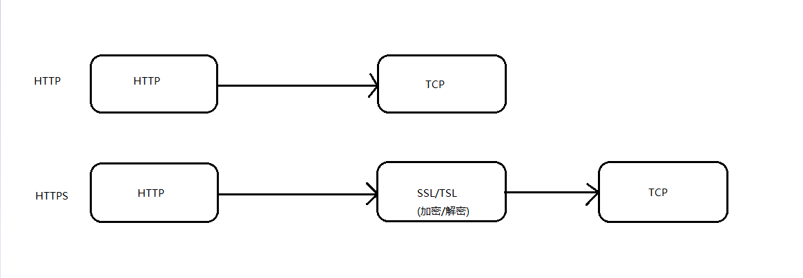

## HTTP1.0、HTTP1.1 和 HTTP2.0 的区别

##### HTTP1.0和HTTP1.1的一些区别

* HTTP1.1支持长连接和请求的流水线处理，在一个TCP连接上可以传送多个HTTP请求和响应，减少了建立和关闭连接的消耗和延迟，在HTTP1.1中默认开启Connection： keep-alive，一定程度上弥补了HTTP1.0每次请求都要创建连接的缺点

* 在HTTP1.0中存在带宽的浪费，不能只请求对象的一部分，请求整个对象，而HTTP1.1在请求头引入了range头域允许只请求资源的某个部分，返回状态码206（Partial Content）

* HTTP1.0不支持断点续传

* 在HTTP1.1中新增了24个错误状态响应码

* HTTP1.1的请求消息和响应消息都应支持Host头域，请求消息中如果没有Host头域会报400（Bad Request）

* HTTP1.0中主要使用header里的If-Modified-Since,Expires来做为缓存判断的标准 而HTTP1.1则引入了更多的缓存控制策略如Entity tag，If-Unmodified-Since, If-Match, If-None-Match等更多可供选择的缓存头来控制缓存策略

##### HTTP与HTTPS的一些区别

* HTTPS协议需要到CA申请证书，一般免费证书很少，需要交费

* HTTP协议运行在TCP之上，所有传输的内容都是明文，HTTPS运行在SSL/TLS之上，SSL/TLS运行在TCP之上，所有传输的内容都经过加密的

* HTTP和HTTPS使用的是完全不同的连接方式，用的端口也不一样，前者是80，后者是443

* HTTPS可以有效的防止运营商劫持，解决了防劫持的一个大问题

##### HTTP2.0和HTTP1.X相比的新特性

* HTTP1.x的解析是基于文本存在缺陷，HTTP2.0的协议解析决定采用二进制格式

* HTTP1.x的header带有大量信息，而且每次都要重复发送，HTTP2.0使用encoder来减少需要传输的header大小，通讯双方各自cache一份header fields表，既避免了重复header的传输，又减小了需要传输的大小

* 多路复用，让所有数据流共用同一个连接，可以更有效地使用 TCP 连接

* 服务推送，提前缓存可能需要的文件