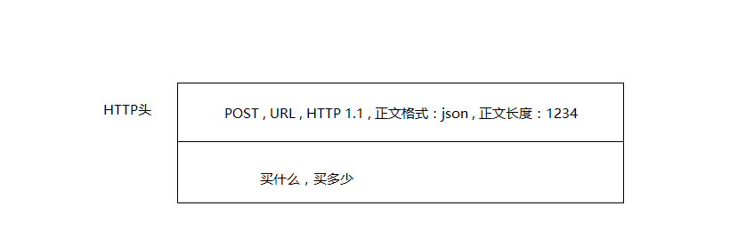
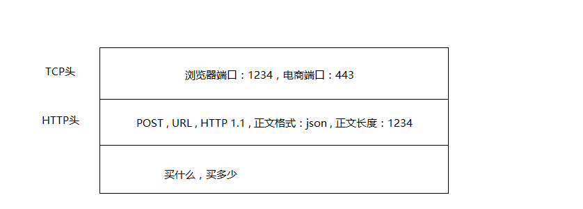
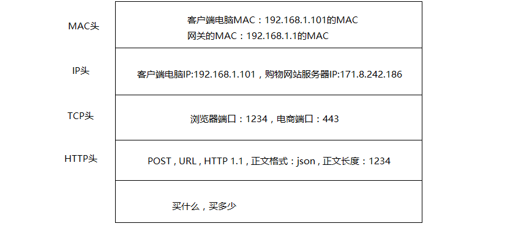

## HTTP协议

现实生活中我们离不开网购，当你想要买一件商品，普遍的做法都是客户端请求购物的网址，返回一个多彩的页面展现给用户
下面用淘宝举例：

1. 当你在浏览器输入https://www.taobao.com 这是一个url，浏览器只知道名字‘www.taobao.com’ 但是不知道具体的地点，于是打开地址簿去查找，可以使用普通的地址簿协议DNS查找，也可以使用精准的地址簿查找协议DNSHTTPS，无论用哪种方法都会找到一个相同IP地址，这个地址相当于互联网的门牌号

2. 知道了目标地址，浏览器开始打包请求，对于普通请求会使用HTTP协议，而对于购物则需要数据加密因此会使用HTTPS，无论使用哪种协议都会写明你要买什么，买多少

    

3. DNS，HTTP，HTTPS所在的层我们称之为应用层，经过应用层封装后，浏览器会将应用层的包交给下一层去完成，通过socket编程来实现

4. 下一层为传输层，传输层有两种协议，一种是无连接的协议UDP，一种是面向连接的协议TCP，对于一些重要数据来讲通常使用TCP协议，所谓的面向连接就是TCP会确保这个包能够达到目标目的地，如果不能达到就会重新发送，直到达到

5. TCP协议里面会有两个端口，一个是浏览器监听的端口，一个是电商的服务器所监听的端口，操作系统往往通过端口来判断它得到的包应该给哪个进程

    

6. 传输层封装完毕后浏览器会将包交给操作系统的网络层，网络层的协议是IP协议，在IP协议里会有源IP地址（浏览器所在机器的IP地址和目标IP地址）

    

7. 操作系统既然知道了目标IP地址，就开始根据这个门牌号找到对应的目标机器，首先会判断这个目标IP是本地还是外地，从门牌号就可以看出来，但是显然目标IP是在外地，操作系统知道目标地址在远方，要去外地了肯定要经过网关，而操作系统启动的时候就会被DHCP协议配置IP地址以及默认的网关的IP地址：192.168.1.1，而操作系统把IP地址发给网关是本地通讯，都在一个村住着，大吼一声谁是192.168.1.1，这时网关会回复我就是，我的本地地址在村东头，这个本地地址就是MAC地址，而大吼那一声就是ARP协议

    

8. 操作系统将IP包交给了下一层，也就是MAC层，网卡在将包发出去，由于这个包里面是有MAC地址的因而他能够达到网关，网关收到包后会判断下一步怎么走，网关通常是一个路由器，到IP地址怎么走这个叫做路由表

9. 通过路由表MAC地址可以找到目标服务器，目标服务器发现MAC地址对上了，取下MAC头，发送给操作系统的网络层，发现IP地址也对上了就取下IP头，IP头里封装的是TCP协议，然后交给传输层，即TCP层，在TCP这一层里面对于每一个收到的包都会有一个回复的包说明收到了，这个回复仅仅是TCP的一个收到回复，这个回复会沿着刚才来的方向回去报个平安

10. 而在过程中网络包丢失了，没有收到回复，一段时间后发送端会重新发送一个这个包，过程一样，知道收到回复，重新发送的这个包是TCP层的重试机制，对于这次购物请求还是一次请求

11. 当网络包安全到达TCP层后，TCP头中有目标端口号，通过这个端口号可以找到网站的进程正在监听的端口号，将这个包发送给网站

12. 网站处理完毕后会发送一个HTTPS的包，这个HTTPS包会像来的时候一样经过各层到达你的电脑，展现数据

问题：已经有目标地址门牌号IP地址了为什么还需要MAC地址？

