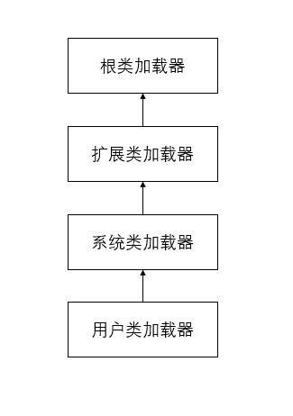

## 类的加载机制

一般来说我们把Java的类加载过程分为三个主要步骤：加载，连接，初始化

### JVM加载类的三步骤：类的加载，连接，初始化

<br>

1.加载（Loading）：它是Java将字节码数据从不同的数据源读到JVM中，并为之创建一个java.lang.Class对象，也就是说，当程序中使用任何类时，系统都会为之建立一个java.lang.Class对象，这里的数据源可能是各种形态，如jar文件，class文件，甚至是网络数据源等。如果输入数据不是ClassFile的结构，则会抛出ClassFormatError

    1）类的加载由类的加载器完成，类加载器通常由JVM提供，这些类加载器也就是前面所有程序运行的基础

    2）JVM提供的这些类加载器通常被称为系统类加载器

    3）可以通过继承ClassLoader基类来创建自己的类加载器

<br>

2.连接（Linking）：当类被加载之后，系统为之生成一个Class对象，接着将会进入连接阶段，连接阶段负责把类的二进制数据合并到JRE中

<br>

    （1）验证（Verification）：虚拟机安全保障，JVM需要验证字节信息是否符合java虚拟机规范，否则就被认为VerifyError,这样就防止了恶意信息或不合规范的信息危害JVM运行，验证阶段有可能会触发更多的class的加载

    （2）准备（Preparation）：创建类或接口中的静态变量，并为变量分配内存的同时设置默认初始值，并不会去执行更进一步的JVM指令

    （3）解释（Resolution）：这一步会将二进制中的符号引用替换成直接引用

<br>

3.初始化（Initialization）：这一步真正去执行类初始化的代码逻辑，包括静态字段赋值的动作以及执行类中的静态初始化块内的逻辑，编译器在编译阶段就会把这部分逻辑处理好，父类型的初始化逻辑高于当前类型的逻辑

在Java类中对类变量指定初始化有两种方式：

    1）声明类变量时指定初始值

    2）使用静态初始化块为类变量指定初始值

<br>


当Java程序首次通过以下6种方式来使用某个类或接口时，系统就会初始化该类或接口

<br>


    1）创建类的实例，为某个类创建实例的方式包括：使用new操作符来创建实例，通过反射来创建实例，通过反序列化的方式来创建实例

    2）调用某个类的静态方法

    3）访问某个类或接口的类变量，或为该类赋值

    4）使用反射方式强制创建某个类或接口对应的java.lang.Class对象

    5）初始化某个类的子类，当初始化某个类的子类时，该子类的所有父类都会被初始化

    6）直接使用java.exe命令来运行某个主类，当运行某个主类时，程序会先初始化该主类

<br>

对于一个final型的类变量，如果该类变量的值在在编译时就可以确定下来，那么这个类变量相当于“宏变量”，java编译器会在编译时直接把这个类变量出现的地方替换成它的值，因此即时程序使用该静态类变量，也不会导致该类的初始化，反之final型的类变量不能确定比如系统时间，则必须等到运行时才可以确定该类变量的值

<br>

```
//实例
public class FinalVariableTest {
    static {
        System.out.println("静态初始化块");
    }
    static final String compileConstant = "test static final Var";
}

//test
public class VariableTest {
    public static void main(String[] args) {
        System.out.println(FinalVariableTest.compileConstant);
    }
}

//结果

test static final Var

Process finished with exit code 0
```
<br>

### 类加载机制

<br>

JVM的类加载机制主要有三种：

<br>

1）全盘负责：当一个类加载器负责加载某个Class时，该Class所依赖的和引用的其他Class也将由该类加载器负责载入，除非显式使用另外一个类的加载器来载入

2）双亲委派：先让父类加载器试图加载该Class，只有在父类加载器无法加载该类时才尝试从自己的类路径加载该类，使用委派模型的目的是避免重复加载Java类型

3）缓存机制：保证所有加载过的Class都会被缓存，当程序需要使用某个Class时，类加载器先从缓存区搜索该Class，只有当缓存器不存在时系统才会读取该类对应的二进制数据，并转换成Class对象，存入缓存区，这就是为什么修改了Class后必须重启JVM程序才会生效的原因


### ClassLoader

1.ClassLoader是用来加载class文件到JVM以供程序使用

2.java程序可以动态加载类定义，而这个动态加载的机制就是通过ClassLoader来实现的

3.当运行一个程序的时候，JVM启动，运行bootstrap classloader, 该ClassLoader加载核心的API（ExtClassLoader和AppCLassLoader也在此时被加载），然后ExtClassLoader加载扩展API，最后AppClassLoader加载CLASSPATH目录下定义的Class，这就是程序的基本流程

    1）bootstrap classloader（启动类加载器）: 不是java语言编写而是JVM实现的一部分,在JVM运行的时候加载java核心的API以满足java程序的最基本需求

    2）ExtClassLoader：java程序实现的，用户定义的ClassLoader，用来加载Java的扩展API也就是/lib/ext中的类

    3）AppCladdLoader：java程序实现的，用户定义的ClassLoader，用来加载用户机器上CLASSPATH设置目录中的calss，通常在没有指定ClassLoader的情况下，用户自定义的类就由该ClassLoader进行加载


  
