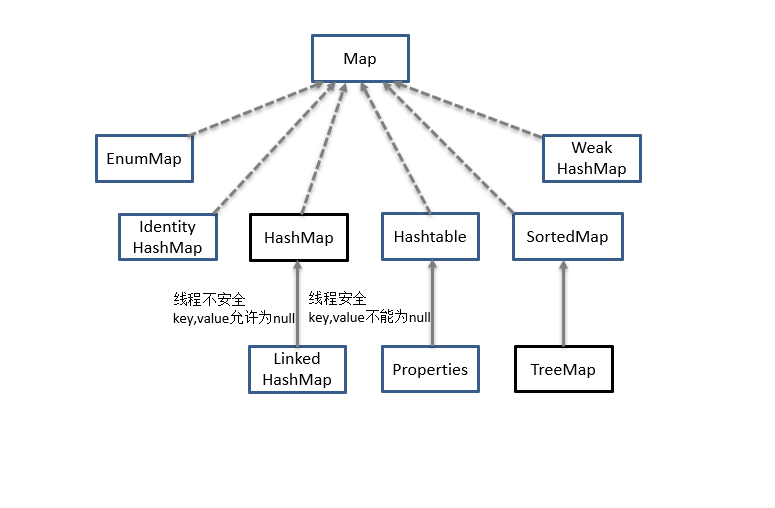
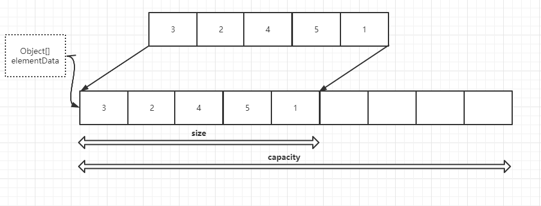
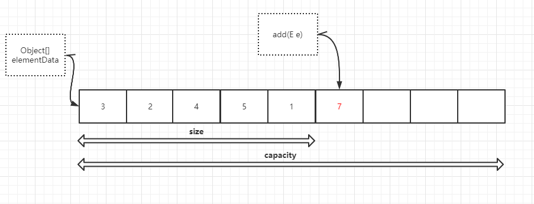
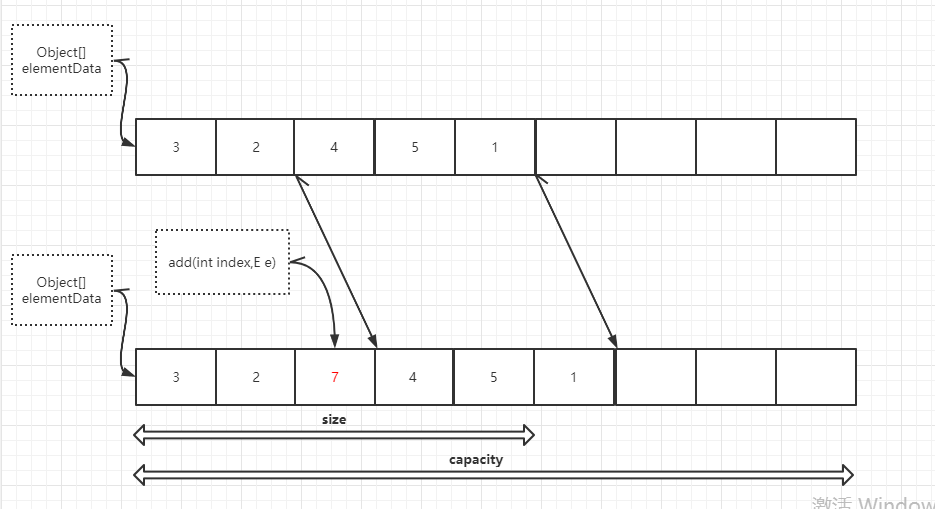
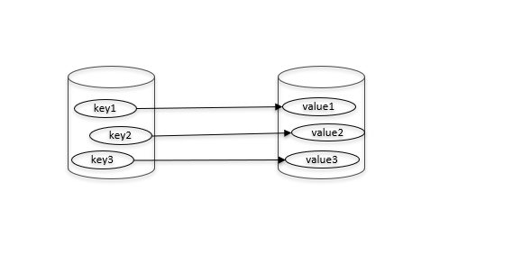
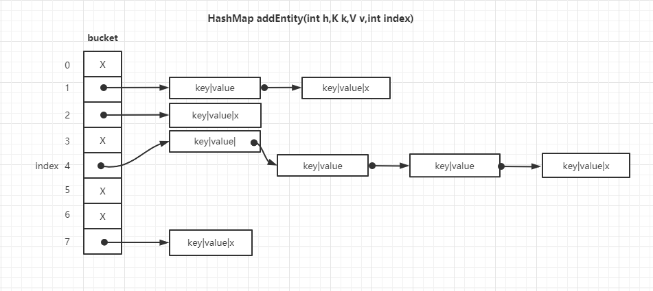
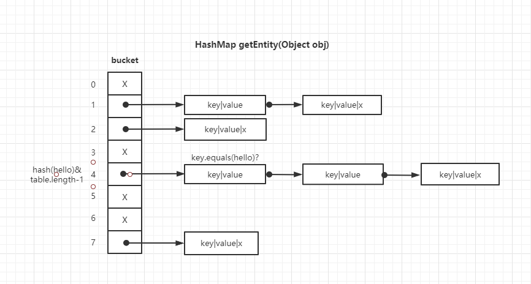

## java集合框架

* java集合框架是一个工具类，用于存储数量不等的对象并可以实现常用的数据结构，栈，队列等，除此之外还可以用于保存具有映射关系的关联数组

* java 集合大致分为四类：set，list，queue，map

* set代表无序不可重复的集合

* list代表有序，重复的集合

* map代表具有映射关系的集合

* queue代表一种队列实现集合

* java集合类主要由两个接口派生而出：Collection和Map，Collection和Map是java集合框架的根接口，这两个接口又包含了一些子接口或实现类

Collection体系继承树

   

Map体系继承树

  


#### Set

* Set集合与Collection基本相同，不同点是Set不允许包含相同的元素

* Set的实现类有三个：HashSet，TreeSet，EnumSet

##### HashSet

* HashSet是Set的典型的实现，大多数使用Set集合的时候都使用这个实现类

* HashSet按Hash算法来存储集合中的元素，具有很好的存储和查找性能

* HashSet具有以下特点：

    1.不能保证元素的排列顺序，顺序可能与添加顺序不同

    2.HashSet不是同步的

    3.集合元素可以为null

* HashSet存储：

    1.当向HashSet中添加元素时，HashSet会调用对象的hashCode()来得到该对象的hashCode值，根据hashCode值来确定该对象的存储位置
如果两个元素通过equals()方法比较返回true但是他们的hashCode值不同 HashSet 会将他们存储在不通的位置，依然可以添加成功
也就是说HashSet判断两个元素相等的标准是两个对象equals()比较相同并且两个对象的hashCode也相同

    2.场景1：两个元素equals相同hashCode不同 导致HashSet会将两个元素添加到不同的位置但又与HashSet规则相冲突

    3.场景2：两个元素equals不同hashCode相同 HashSet试图将他们保存在相同的位置但又不行，实际会在这个位置用链式结构保存多个对象

* HashSet访问集合元素时是根据元素的hashCode值快速定位，如果HashSet中有两个以上的元素有相同的hashCode 会导致性能下降

* 往HashSet中保存对象时 ，要重写这个类的hashCode()和equals() 并尽量保证对比时返回true


#####  LinkedHashSet

* LinkedHashSet是HashSet的一个子类，也是通过hashCode来决定元素的插入位置

* 不同的是它使用链表来维护元素的次序，这样使得元素看起来是以顺序插入

* LinkedHashSet需要维护元素的插入次序，导致性能低于HashSet，但迭代访问Set中的元素时还是有很好的性能的

##### TreeSet

* TreeSet是SortedSet接口的实现类，TreeSet确实可以保证集合元素处于排序状态，与HashSet相比还提供额外的方法：

   Comparator comparator() ： 如果采用定制排序则返回定制排序的Comparator，自然排序则返回null

   Object first() ： 返回第一个元素

   Object last() ： 返回最后一个元素

   Object lower() ： 返回指定元素之前的元素

   Object hight() ： 返回指定元素之后的元素

* TreeSet 支持自然顺序访问，但是添加，删除，包含等操作要相对低效（long(n)时间）

* TreeSet 支持两种排序方式：自然排序，定制排序

   1.自然排序

   TreeSet调用集合元素compareTo()来比较元素之间的大小 然后按升序排序

   java提供一个Comparable接口，该接口里定义了一个compareTo()， 实现该方法的类必须实现该方法，这样就可以比较大小

   如果compareTo()返回0，表明两个对象相等，返回一个正整数，表明obj1 > obj2，返回一个负整数表明 obj1 < obj2
    
   2.定制排序

   TreeSet通过Comparator对象或者Lambda表达式的帮助实现定制排序，依然不可以向TreeSet中添加不通的对象，否则会引发ClassCaseException


##### EnumSet

* EnumSet是一个专门为枚举设计的集合类，EnumSet中所有元素的类型必须为枚举值

* EnumSet的集合元素也是有序的 以枚举值在Enum类内的定义顺序来决定集合元素的顺序

* EnumSet以位向量的形式存储，这种存储非常紧凑，高效，因此EnumSet对象占用的内存很小，而且运行效率很好

* EnumSet不允许插入null元素，视图插入null 会抛出NullPointerException异常，如果判断EnumSet中是否有null或试图删除null都不会抛出异常

* EnumSet没有暴露任何构造器来创建该类的实例，程序应该通过它提供的类方法来创建EnumSet实例：

   EnumSet allOf(Class elementType)：创建一个包含指定枚举类里所有值的EnumSet集合

   EnumSet complementOf(EnumSet s)：创建一个元素类型与指定EnumSet里元素类型相同的EnumSet集合

   EnumSet copyOf(Collection c)：使用一个普通集合来创建EnumSet集合

   EnumSet copyOf(EnumSet s)：创建一个与指定EnumSet具有相同元素类型，相同集合元素的EnumSet集合

   EnumSet noneOf(Class elementType)：创建一个元素类型为指定枚举类型的空EnumSet

   EnumSet of(E first，E... rest)：创建一个包含一个或者多个枚举值的EnumSet集合，传入的多个枚举值必须属于同一枚举类

   EnumSet range(E from，E to)：创建一个包含从from 枚举值到to 枚举值范围内所有枚举值的EnumSet集合

* 注意 ： 当试图复制一个Collection集合里的元素进行创建EnumSet集合时，必须保证Commection集合里所有元素都是同一枚举类型的枚举值


##### 各Set实现类的性能分析

1. HashSet和TreeSet是Set的最常用也是最典型实现

2. HashSet的性能总是比TreeSet好，特别是最常用的添加，删除元素等操作，因为TreeSet需要提供额外的红黑树来维护集合元素的次序

3. 只有当需要一个保持排序的Set时才会使用TreeSet 否则都应该使用HashSet

4. 对于普通的插入，删除操作 HashSet的子类LinkedHashSet 比HashSet稍微慢一点，因为需要维护链表造成的额外开销，但由于有了链表遍历LinkedHashSet 会更快

5. EnumSet是Set的实现类中性能最好的，但它只能保持同一枚举类的枚举值来最为集合元素

6. Set的三个实现类都是线程不安全的多线程访问修改情况下需要使用Collections 的工具类synchronizedSortedSet方法来包装该Set集合：

SortedSet s = Collections.synchronizedSortedSet(new TreeSet(...));


#### List

* List集合代表一个元素有序，可重复的集合，集合中每一个元素都有其对应的顺序索引

* List集合允许使用重复元素，可以通过索引来访问指定位置的集合元素

* List集合默认按元素添加顺序设置元素索引

* List集合里根据索引来操作集合元素的方法：

   void add(int index，Object element)：插入集合元素到index处

   int indexOf(Object o)：返回对象o在集合中第一次出现的位置索引

   int lastIndexOf(Object o)：返回对象o在集合中最后一次出现的位置

   Object remove(int index)：删除index索引位置的元素

   Object set(int index，Object element)：将index索引处元素替换成element，返回被替换的旧元素

   List subList(int fromIndex，int toIndex)：返回从索引fromIndex（包含）到索引toIndex（不包含）处所有集合元素组成的子集合

   void replaceAll(UnaryOperator operator)：根据operator指定的计算规则重新设置List集合的所有元素

   void sort(Comparator c)：根据Comparator参数对List集合元素排序

* List的实现类有三个：ArrayList，Vector，LinkedList

##### ArrayList & Vector

* ArrayList和Vector是List类的经典实现，基于数组实现的List类，所以ArrayList和Vector类封装了一个动态的，允许再分配的Object[]数组，ArrayList和Vector对象使用initialCapacity参数来设置该数组的长度，当向ArrayList或者Vector中添加元素超出了该数组的长度时，他们的initialCapacity会自动增加

* 如果向ArrayList或Vector中添加大量元素时可以使用ensureCapacity(int minCapacity)方法一次性的增加initialCapacity，这样可以减少重分配的次数，从而提高性能

  

* 如果开始就知道ArrayList或者Vector集合需要保存多少个元素，可以在创建它们时就指定initialCapacity的大小

* 如果创建空的ArrayList和Vector时不指定initialCapacity参数，则Object[]数组的默认长度为10

* ArrayList和Vector还提供了两个方法来重新分配Object[]数组

   void ensureCapacity(int minCapacity)：将ArrayList或Vector集合的Object[]数组长度增加大于或等于minCapacity值

   void trimToSize()：调整ArrayList或Vector集合的Object[]数组长度为当前元素的个数，调用该方法可以减少ArrayList或Vector集合对象占用的存储空间

* ArrayList和Vector的区别

   1.ArrayList和Vector在用法上几乎相同，但vector是一个很古老的集合，从JDK1.0开始就有了

   2.Vector有很多缺点，尽量不要使用，可以根据需要自动增加容量，当数组已满时，会创建新的数组，扩容提高一倍并拷贝原有数组数据

   3.ArrayList是线程不安全的，ArrayList没有实现同步（synchronized），需要用程序保证集合的同步性

   4.Vector是线程安全的，无需程序保证该集合的同步性

   5.因为Vector是线程安全的所以性能比ArrayList要低

   6.ArrayList在扩容时增加50%

* ArrayList方法剖析

   1.set()：底层是数组，对指定位置的元素赋值就可
    
   ```
   public E set(int index, E element) {
      rangeCheck(index);//下标越界检查
      E oldValue = elementData(index);
      elementData[index] = element;//赋值到指定位置，复制的仅仅是引用
      return oldValue;
   }
   ```

   2.get()：由于底层是数组是Object[]，得到元素后需要进行类型转换

   ```
   public E get(int index) {
      rangeCheck(index);//下标越界检查
      return (E) elementData[index];//类型转换
   }
   ```

   3.add()：与Vector不同，ArrayList没有push_back()方法，对应的方法是add(E e)，ArrayList也没有insert()方法，对应的方法是add(int index, E e)，该方法需要先对元素进行移动，然后完成插入操作，也就意味着该方法有着线性的时间复杂度，可能会导致capacity不足，因此在添加元素之前，都需要进行剩余空间检查，如果需要则自动扩容。扩容操作最终是通过grow()方法完成的

  

  

   ```
   private void grow(int minCapacity) {
      int oldCapacity = elementData.length;
      int newCapacity = oldCapacity + (oldCapacity >> 1);//原来的1.5倍
      if (newCapacity - minCapacity < 0)
         newCapacity = minCapacity;
      if (newCapacity - MAX_ARRAY_SIZE > 0)
         newCapacity = hugeCapacity(minCapacity);
      elementData = Arrays.copyOf(elementData, newCapacity);//扩展空间并复制
   }
   ```

   4.addAll()：能够一次添加多个元素，根据位置不同也有两个版本，一个是在末尾添加的addAll(Collection<? extends E> c)方法，一个是从指定位置开始插入的addAll(int index, Collection<? extends E> c)方法。跟add()方法类似，在插入之前也需要进行空间检查，如果需要则自动扩容；如果从指定位置插入，也会存在移动元素的情况。 addAll()的时间复杂度不仅跟插入元素的多少有关，也跟插入的位置相关

   5.remove()：有两个版本，一个是remove(int index)删除指定位置的元素，另一个是remove(Object o)删除第一个满足o.equals(elementData[index])的元素。删除操作是add()操作的逆过程，需要将删除点之后的元素向前移动一个位置。需要注意的是为了让GC起作用，必须显式的为最后一个位置赋null值

   ```
   public E remove(int index) {
      rangeCheck(index);
      modCount++;
      E oldValue = elementData(index);
      int numMoved = size - index - 1;
      if (numMoved > 0)
         System.arraycopy(elementData, index+1, elementData, index, numMoved);
      elementData[--size] = null; //清除该位置的引用，让GC起作用
      return oldValue;
   }
   ```

##### 固定长度List

* 工具类Arrays提供asList(Object... a)方法可以把一个数组或者指定个数的对象转换成一个List集合，这个List集合既不是ArrayList实现类也不是Vector实现类的实例，而是Arrays的内部类ArrayList的实例

* Arrays.ArrayList是一个固定长度的List集合，程序只能遍历，不可增加，删除，否则会引发UnsupportedOperationException异常


#### Queue

* Queue用于模拟队列这种数据结构，队列通常是指FIFO容器，通常不允许随机访问队列中的元素

* Queue接口中定义以下几个方法：

   void add(Object e)： 将指定元素加入队尾

   Object element()：获取队列头部的元素，但不是删除元素

   boolean offer(Object e)：将指定元素加入此队列尾部，当使用有容量限制的队列时，此方法通常比add(Object e)方法更好

   Object peek()：获取队列头部的元素，但不是删除元素，如果此队列为空则返回null

   Object poll()：获取队列头部的元素，并删除该元素

* Queue有个实现类：PriorityQueue，ArrayDeque


##### PriorityQueue

* PriorityQueue是一个比较标准的队列实现类，PriorityQueue保存队列的顺序并不是按照加入队列的顺序，而是按队列元素的大小进行重新排序

* 当使用peek()或者poll()取出队列中的元素时，并不是取出最先进入队列的元素，而是取出最小的元素

* 从意义上看PriorityQueue已经违反了队列的基本规则：FIFO

* PriorityQueue不允许插入null元素

* PriorityQueue有两种排序方式：自然排序，定制排序

   1. 自然排序：元素必须实现Comparable接口，而且应该是同一个类的多个实例，否则会造成ClassCaseException异常

   2. 定制排序：不要求队列实现Comparabel接口，传入一个Comparator对象，负责队列中所有元素的排序

* 方法剖析

   1.add()，offer()：add(E e)和offer(E e)的语义相同，都是向优先队列中插入元素，只是Queue接口规定二者对插入失败时的处理不同，前者在插入失败时抛出异常，后则则会返回false

   ```
   //offer(E e)
   public boolean offer(E e) {
      if (e == null)//不允许放入null元素
         throw new NullPointerException();
      modCount++;
      int i = size;
      if (i >= queue.length)
         grow(i + 1);//自动扩容
      size = i + 1;
      if (i == 0)//队列原来为空，这是插入的第一个元素
         queue[0] = e;
      else
         siftUp(i, e);//调整
      return true;
   }

   //siftUp()
   private void siftUp(int k, E x) {
      while (k > 0) {
         int parent = (k - 1) >>> 1;//parentNo = (nodeNo-1)/2
         Object e = queue[parent];
         if (comparator.compare(x, (E) e) >= 0)//调用比较器的比较方法
               break;
         queue[k] = e;
         k = parent;
      }
      queue[k] = x;
   }
   ```

   2.element()和peek()：element()和peek()的语义完全相同，都是获取但不删除队首元素，也就是队列中权值最小的那个元素，二者唯一的区别是当方法失败时前者抛出异常，后者返回null

   ```
   //peek()
   public E peek() {
      if (size == 0)
         return null;
      return (E) queue[0];//0下标处的那个元素就是最小的那个
   }
   ```

   3.remove()和poll()：remove()和poll()方法的语义也完全相同，都是获取并删除队首元素，区别是当方法失败时前者抛出异常，后者返回null

   ```
   public E poll() {
      if (size == 0)
         return null;
      int s = --size;
      modCount++;
      E result = (E) queue[0];//0下标处的那个元素就是最小的那个
      E x = (E) queue[s];
      queue[s] = null;
      if (s != 0)
         siftDown(0, x);//调整
      return result;
   }

   //remove(Object o)
   public boolean remove(Object o) {
	//通过遍历数组的方式找到第一个满足o.equals(queue[i])元素的下标
      int i = indexOf(o);
      if (i == -1)
         return false;
      int s = --size;
      if (s == i) //情况1
         queue[i] = null;
      else {
         E moved = (E) queue[s];
         queue[s] = null;
         siftDown(i, moved);//情况2
         ......
      }
      return true;
   }
   ```

##### ArrayDeque


* Deque接口是Queue接口的子接口，它代表一个双端队列

* Deque不仅可以当成双端队列来使用，也可以当场栈来使用，改类包含了pop()和push()

* Deque提供一个典型的接口实现类：ArrayDeque，是一个基于数组实现的双端队列，创建Deque时同样可以指定一个numElements参数，该参数用于指定Object[]数组的长度：如果不指定numElements参数，Deque底层数组的长度为16

* ArrayList和ArrayDeque两个集合类的实现机制基本相似，它们的底层都采用一个动态的，可分配的Object[]数组来存储集合元素，当集合元素超出了该数组的容量时，系统会在底层重新分配一个Object[]数组来存储集合元素

* ArrayDeque是非线程安全的，另外，该容器不允许放入null元素

* 方法剖析

   1.addFirst()：addFirst(E e)在Deque的首端插入元素，也就是在head的前面插入元素，在空间足够且下标没有越界的情况下，只需要将elements[--head] = e，

   ```
   //addFirst(E e)
   public void addFirst(E e) {
      if (e == null)//不允许放入null
         throw new NullPointerException();
      elements[head = (head - 1) & (elements.length - 1)] = e;//2.下标是否越界，elements数组至少有一个空位
      if (head == tail)//1.空间是否够用
         doubleCapacity();//扩容
   }
   //扩容函数doubleCapacity()
   //doubleCapacity()
   private void doubleCapacity() {
      assert head == tail;
      int p = head;
      int n = elements.length;
      int r = n - p; // head右边元素的个数
      int newCapacity = n << 1;//原空间的2倍
      if (newCapacity < 0)
         throw new IllegalStateException("Sorry, deque too big");
      Object[] a = new Object[newCapacity];
      System.arraycopy(elements, p, a, 0, r);//复制右半部分
      System.arraycopy(elements, 0, a, r, p);//复制左半部分
      elements = (E[])a;
      head = 0;
      tail = n;
   }
   ```

   2.addLast()：在Deque的尾端插入元素，如果空间已经用光，则调用doubleCapacity()进行扩容

   ```
   public void addLast(E e) {
      if (e == null)//不允许放入null
         throw new NullPointerException();
      elements[tail] = e;//赋值
      if ( (tail = (tail + 1) & (elements.length - 1)) == head)//下标越界处理
         doubleCapacity();//扩容
   }
   ```

   3.pollFirst()：删除并返回Deque首端元素，也即是head位置处的元素。如果容器不空，只需要直接返回elements[head]即可，当然还需要处理下标的问题，ArrayDeque中不允许放入null，当elements[head] == null时，意味着容器为空

   ```
   public E pollFirst() {
      E result = elements[head];
      if (result == null)//null值意味着deque为空
         return null;
      elements[h] = null;//let GC work
      head = (head + 1) & (elements.length - 1);//下标越界处理
      return result;
   }
   ```

   4.pollLast()：删除并返回Deque尾端元素

   ```
   public E pollLast() {
      int t = (tail - 1) & (elements.length - 1);//tail的上一个位置是最后一个元素
      E result = elements[t];
      if (result == null)//null值意味着deque为空
         return null;
      elements[t] = null;//let GC work
      tail = t;
      return result;
   }
   ```

   5.peekFirst()：返回但不删除Deque首端元素

   ```
   public E peekFirst() {
      return elements[head];
   }
   ```

   6.peekLast()：返回但不删除Deque尾端元素

   ```
   public E peekLast() {
      return elements[(tail - 1) & (elements.length - 1)];
   }
   ```


##### LinkedList

* LinkedList是List接口的实现类，这意味着它是List集合，可以根据索引来访问集合中的元素，除此之外LinkedList还实现了Deque接口，可以被当做双端队列来使用，因此它既可以被当做栈来使用也可以被当做队列来使用

* LinkedList与ArrayList，ArrayDeque的实现机制完全不同，ArrayList和ArrayDeque内部以数组的形式来保存集合中的元素，因此随意访问具有较好的性能，而LinkedList内部以链表的形式保存集合中的元素，随机访问性能较差，但是在插入，删除元素时性能比较出色，只需要改变指针所指地址，LinkedList的实现方式决定了所有跟下标相关的操作都是线性时间，而在首段或者末尾删除元素只需要常数时间，LinkedList没有实现同步synchronized方法，需要多个线程并发访问，可以先采用Collections.synchronizedList()方法对其进行包装

* 方法剖析

   1.add()：add(E e)，在LinkedList的末尾插入元素，因为有last指向链表末尾，在末尾插入元素的花费是常数时间,修改几个相关引用即可；add(int index, E element)，在指定下表处插入元素，需要先通过线性查找找到具体位置，然后修改相关引用完成插入操作
  

  


   ```
   //add(E e)
   public boolean add(E e) {
      final Node<E> l = last;
      final Node<E> newNode = new Node<>(l, e, null);
      last = newNode;
      if (l == null)
         first = newNode;//原来链表为空，这是插入的第一个元素
      else
         l.next = newNode;
      size++;
      return true;
   }


   //add(int index, E element)
   public void add(int index, E element) {
      checkPositionIndex(index);//index >= 0 && index <= size;
      if (index == size)//插入位置是末尾，包括列表为空的情况
         add(element);
      else {
         Node<E> succ = node(index);//1.先根据index找到要插入的位置
         //2.修改引用，完成插入操作。
         final Node<E> pred = succ.prev;
         final Node<E> newNode = new Node<>(pred, e, succ);
         succ.prev = newNode;
         if (pred == null)//插入位置为0
            first = newNode;
         else
            pred.next = newNode;
         size++;
      }
    }
   ```

   2.remove()：remove(Object o)删除跟指定元素相等的第一个元素，remove(int index)删除指定下标处的元素，两种方式都是线性时间复杂度

   ```
   //unlink(Node<E> x)，删除一个Node
   E unlink(Node<E> x) {
      final E element = x.item;
      final Node<E> next = x.next;
      final Node<E> prev = x.prev;
      if (prev == null) {//删除的是第一个元素
         first = next;
      } else {
         prev.next = next;
         x.prev = null;
      }
      if (next == null) {//删除的是最后一个元素
         last = prev;
      } else {
         next.prev = prev;
         x.next = null;
      }
      x.item = null;//let GC work
      size--;
      return element;
   }
   ```

   3.get()：get(int index)得到指定下标处元素的引用，通过调用上文中提到的node(int index)方法实现

   ```
   public E get(int index) {
      checkElementIndex(index);//index >= 0 && index < size;
      return node(index).item;
   }
   ```

   4.set()：set(int index, E element)方法将指定下标处的元素修改成指定值，也是先通过node(int index)找到对应下表元素的引用，然后修改Node中item的值

   ```
   public E set(int index, E element) {
      checkElementIndex(index);
      Node<E> x = node(index);
      E oldVal = x.item;
      x.item = element;//替换新值
      return oldVal;
   }
   ```


##### 各种线性表的性能分析

1. Java提供的List就是一个线性表接口，而ArrayList，LinkedList又是线性表的两种典型实现：基于数组的线性表和基于链的线性表

2. Queue代表了队列，Deque代表了双端队列（即可作为队列使用，也可作为栈使用）

3. LinkedList集合不仅提供了List的功能，还提供了双端队列，栈的功能

4. 数组已一块连续内存来保存所有的数组元素，所以数组在随机访问时性能最好，而内部以链表最为底层实现的集合在执行插入，删除操作时有较好的性能

5. 总体来说ArrayList比LinkedList的性能要好，所以大部分考虑ArrayList

6. 如果需要遍历List集合元素，对于ArrayList，Vector，应该使用随机访问方法（get）来遍历集合元素，这样性能最好，对于LinkedList集合，则应该采用迭代器（Iterator）来遍历集合元素

7. 如果需要经常插入删除操作，来改变包含大量数据的List集合大小，则应该考虑使用LinkedList集合，使用ArrayList和Vector可能需要经常分配内部数组的大小，效果可能更差

8. 多线程情况下应该考虑使用Collections将集合包装成线程安全的


#### Map

* Map用于保存具有映射关系的数据，因此Map里保存这键值对，key，value可以是任何类型的数据，Map的key不允许重复，所以Map对象中的任何两个key通过equals()比较都应该是false

* key ，value之间总是存在一对一的关系，指定的key总是能找到确定的value


  

* 如果单看Map里的key，它们组成了一个Set集合，实际上Map确实包含keySet()，用于返回Map里的所有key组成Set集合

* Map子类与Set子类的名称也很相似

   Set下子类：HashSet，TreeSet，LinkedHashSet，EnumSet，SortedSet(接口)

   Map下子类：HashMap，TreeMap，LinkedHashMap，EnumMap，SortedMap(接口)

* Java是先实现了Map 在通过包装一个value全部为null的的Map实现了Set集合

* 如果把Map里的所有value放在一起来看，它们又类似一个List：元素与元素之间可以重复，每个元素可以通过索引来查找，只是Map中的索引不在使用整数值，而是以另一个对象作为索引

* Map的实现类有八个：HashMap，Hashtable，LinkedHashMap，Properties，TreeMap，WeakHashMap，IdentityHashMap，EnumMap


##### HashMap

* HashMap是Map接口的典型实现类

* HashMap是用于存储Key-Value键值对的集合，而每一个键值对也叫做Entry 这些Entry分散在一个数组中，这个数组就是HashMap的主干 默认初始长度是16 并且每次自动扩展收手动初始化长度时 长度必须是2的幂

* HashMap数组中每一个元素的初始值都是null

* 对于HashMap最常用的两个方法就是get 和put ：

   1. put：当调用hashMap.put("hello"，"world") 插入一个Key为hello 的元素这个时候需要利用哈希函数来确定这个Entry的位置
 
      index = Hash("hello")
 
      假设index=2 那么这个 结果将放在主干数组2的位置 但是HashMap的长度是有限的 当插入的Entry越来越多时 HashMap也会有index冲突的时候 这个时候就用链表来解决

      HashMap数组的每一个元素不止是一个Entry对象，还是一个链表的头节点，每一个Entry对象通过next指针指向它的下一个Entry节点，当新来的Entry映射到冲突的数组位置只要插入到链表的头部就可以了（头插法 之所以采用头插法是认为后插入的Entry被查找的可能性更大）

      

   2. get：当使用get根据Key来查找Value的时候 首先会把输入的Key做一次Hash映射
 
      index=Hash("hello")
 
      这时就需要根据对应Entry的头节点一直向下查找

      

* HashMap的容量是有限的 当多次插入元素时 HashMap达到一定的饱和度，Key映射位置发生冲突的几率会逐渐提高 这个时候HashMap需要扩展它的长度 也就是进行resize 而发生redize的因素有两个：

   1. Capacity
    HashMap的当前长度

   2. LoadFactor
    HashMap负载因子 默认值为0.75f

   3. 衡量HashMap是否进行resize的条件公式为：HashMap.size > = Capacity * LoadFactor


   4. 扩容的步骤：
 
      1).扩容：创建一个新的Entry数组，长度为原数组的2倍

      2).Rehash：遍历原数组 把所有的Entry重新hash到新的数组，

* HashMap在高并发情况下容易出现链表环
 
   1. ConurrentHashMap：

      ConcurrentHashMap集合中有2的n次方个Segment 共同保存在一个名为Segments的数组当中，Segment本身就相当于一个HashMap对象，同HashMap一样，Segment包含一个HashEntry数组，数组中每一个HashEntry即时一个键值对也是一个链表的头节点
 
   2. 可以看成ConcurrentHashMap是一个二级的哈希表 在一个总的哈希表下面有若干个子哈希表
 
   3. ConcurrentHashMap的优势就是常采用锁分段技术 每一个Segment就好比一个自治区 读写操作高度自治

   4. ConcurrentHashMap的put方法
 
      1).为输入的key做哈希运算，得到hash值
 
      2).通过hash值定位到对应的Segment
 
      3).获取可重入锁
 
      4).再次通过hash值定位到Segment当中数组的具体位置
 
      5).插入或覆盖HashEntry对象
 
      6).释放锁


##### Hashtable

* HashMap与Hashtable都是Map接口的典型实现类，它们之间的关系就如ArrayList与Vector的关系

* Hashtable是一个古老的Map实现类，从JDK1.0就开始出现，它包含了两个繁琐的方法：elements()(类似于Map接口定义的values())和keys()(类似于Map接口定义的keySet())，现在很少使用

* Hashtable是线程安全的Map实现，但是HashMap是线程不安全的实现，所以HashMap比Hashtable的性能高一点：但如果有多个线程访问一个Map对象，使用Hashtable实现会更好

* Hashtable 不允许使用null作为key和value，如果试图把null值放进Hashtable中将会引发NullPointerException异常，但是HashMap可以使用null作为key或value

* Hashtable是一个古老的类，它的命名甚至没有遵循Java的命名规范：单词首字母大写，与Vector类似的是尽量少用Hashtable实现类，即时需要创建线程安全的Map实现类，也无需实现Hashtable，而是可以通过Collection工具类的HashMap变成线程安全的

* HashMap与Hashtable包含一个containValue()，用于判断是否包含指定的value


##### LinkedHashMap

* HashSet有一个LinkedHashSet子类HashMap也有一个LinkedHashMap子类

* LinkedHashMap使用双向链表来维护key-value对的次序（其实只需要考虑key的次序），该链表负责维护Map的迭代顺序，迭代顺序与key-value对的插入顺序保持一致

* LinkedHashMap可以避免对HashMap，Hashtable里的key-value对进行排序，只要插入key-value对时保持顺序即可，同时又可避免使用TreeMap所增加的成本

* LinkedHashMap需要维护元素插入顺序，性能稍微低于HashMap，但因为是以链表维护内部顺序，所以在迭代访问Map里的全部元素时将有较好的性能


##### Properties

* Properties类是Hashtable的子类，该对象在处理属性文件时特别方便

* Properties类可以把Map对象和属性文件关联起来，从而可以把Map中的key-value对写入属性文件中，也可以把属性文件中“属性名=属性值”加载到Map对象中

* 由于属性文件中的属性名和属性值都只能是字符串类型，所以Properties里的key和value都是字符串类型

    String getProperty(String key)：获取Properties中指定属性名的属性值

    String getProperty(String key，String defaultValue)：获取Properties中指定属性名的属性值，key不存在时使用默认值

    Object setProperty(String key，String value)：设置属性值

    void load(InputStream inStream)： 从输入流加载key-value对，后追加到Properties里，不保证key-value对之间的次序

    void store(OutputStream out，String comments)：将Properties中的key-value对输出到指定的属性文件中（以输出流表示）

##### TreeMap

* TreeMap是SortedMap接口的实现类 TreeMap就是一个红黑树的结构，每一个key-value对即为红黑树的一个节点，TreeMap存储节点时需要根据key对节点进行排序，TreeMap可以保证所有的key-value对处于有序状态

* TreeMap也有两种排序方式： 自然排序，定制排序

   1.自然排序：TreeMap的所有key必须实现Comparable接口，而所有的key应该是同一个类的对象，否则将会抛出ClassCaseException异常

   2.定制排序：创建TreeMap时，传入一个Comparator对象，该对象负责对TreeMap中的所有key进行排序，采用定制排序时不需要Map的key实现Comparable接口

* TreeMap判断两个key相等的标准是：两个key通过compareTo()返回0，TreeMap就认为这两个key是相等的

* 如果自定义类作为TreeMap的key， 且想让TreeMap良好的工作，则重写该类的equals()和compareTo()时应保持一致的返回结果：两个key通过equals()比较时返回true，通过compareTo()比较时返回0，如果equals()和compareTo()返回结果不一致，TreeMap与Map接口的规则就会冲突

* containsKey(), get(), put(), remove()都有着log(n)的时间复杂度

* 方法剖析

   1.get()：get(Object key)方法根据指定的key值返回对应的value，根据key的自然顺序（或者比较器顺序）对二叉查找树进行查找

   ```
   //getEntry()方法
   final Entry<K,V> getEntry(Object key) {
   ......
      if (key == null)//不允许key值为null
         throw new NullPointerException();
      Comparable<? super K> k = (Comparable<? super K>) key;//使用元素的自然顺序
      Entry<K,V> p = root;
      while (p != null) {
         int cmp = k.compareTo(p.key);
         if (cmp < 0)//向左找
               p = p.left;
         else if (cmp > 0)//向右找
               p = p.right;
         else
               return p;
      }
      return null;
   }
   ```

   2.put()：put(K key, V value)方法是将指定的key, value对添加到map里，首先会对map做一次查找，看是否包含该元组，如果已经包含则直接返回，如果没有找到则会在红黑树中插入新的entry，如果插入之后破坏了红黑树的约束条件，还需要进行旋转

   ```
   public V put(K key, V value) {
	......
      int cmp;
      Entry<K,V> parent;
      if (key == null)
         throw new NullPointerException();
      Comparable<? super K> k = (Comparable<? super K>) key;//使用元素的自然顺序
      do {
         parent = t;
         cmp = k.compareTo(t.key);
         if (cmp < 0) t = t.left;//向左找
         else if (cmp > 0) t = t.right;//向右找
         else return t.setValue(value);
      } while (t != null);
      Entry<K,V> e = new Entry<>(key, value, parent);//创建并插入新的entry
      if (cmp < 0) parent.left = e;
      else parent.right = e;
      fixAfterInsertion(e);//调整
      size++;
      return null;
   }
   ```

   3.remove()：remove(Object key)的作用是删除key值对应的entry

   ```
   // 红黑树entry删除函数deleteEntry()
   private void deleteEntry(Entry<K,V> p) {
      modCount++;
      size--;
      if (p.left != null && p.right != null) {// 2. 删除点p的左右子树都非空。
         Entry<K,V> s = successor(p);// 后继
         p.key = s.key;
         p.value = s.value;
         p = s;
      }
      Entry<K,V> replacement = (p.left != null ? p.left : p.right);
      if (replacement != null) {// 1. 删除点p只有一棵子树非空。
         replacement.parent = p.parent;
         if (p.parent == null)
               root = replacement;
         else if (p == p.parent.left)
               p.parent.left  = replacement;
         else
               p.parent.right = replacement;
         p.left = p.right = p.parent = null;
         if (p.color == BLACK)
               fixAfterDeletion(replacement);// 调整
      } else if (p.parent == null) {
         root = null;
      } else { // 1. 删除点p的左右子树都为空
         if (p.color == BLACK)
               fixAfterDeletion(p);// 调整
         if (p.parent != null) {
               if (p == p.parent.left)
                  p.parent.left = null;
               else if (p == p.parent.right)
                  p.parent.right = null;
               p.parent = null;
         }
      }
   }
   ```

##### WeakHashMap

* WeakHashMap与HashMap的用法基本相似，区别在于HashMap的key保留了对实际对象的强引用，意味着只要该HashMap对象不被销毁该HashMap的所有key所引用的对象就不会被垃圾回收，HashMap也不会自动删除这些key所对应的key-value对，但是WeakHashMap的key只保留对实际对象的弱引用，意味着如果WeakHashMap对象的key所引用的对象没有被其他强引用变量所引用，则这些key所引用的对象可能被垃圾回收，WeakHashMap也可能自动删除这些key所对应的value对

    ```
    public class WeakHashMapTest
    {
       public static void main(String[] args)
       {
          WeakHashMap whm = new WeakHashMap();
          whm.put(new String("qianqian")，new String("腿长"));
          whm.put(new String("nana")，new String("腰细"));
          whm.put(new String("lingling")，new String("肤白"));
          whm.put("nannan"， new String("貌美"));
          //垃圾回收
          System.gc();
          System.runFinalization();
          System.out.println(whm);
       }
    }
    
    {nannan=貌美}
    ```

如果需要使用WeakHashMap的key来保留对象的弱引用，则不要让该key所引用的对象具有任何强引用，否则将失去WeakHashMap的意义


##### IdentityHashMap

* IdentityHashMap与HashMap基本类似，它在处理两个key相等时比较独特

* 在IdentityHashMap中如果两个key严格相等（key1==key2）时，IdentityHashMap才认为两个key相等，对于普通的HashMap而言只要key1与key2通过equals()比较返回true，且他们的hashCode值相等即可

* IdentityHashMap是一个特殊的Map实现，此类实现Map接口时有意违反了Map的通常规范：IdentityHashMap要求两个key严格相等时才认为两个key相等

* IdentityHashMap提供了与HashMap基本相似的方法，也允许使用null作为key和value，与HashMap相似：IdentityHashMap也不能保证key-value对之间的顺序，更不能保证它们的顺序随时间推移不变

    ```
    
    public class IdentityHashMapTest
    {
       public static void main(String[] args)
       {
          IdentityHashMap ihm = new IdentityHashMap();
          ihm.put(new String("nenmo")，"nana");
          ihm.put(new String("nenmo")，"qianqian");
          ihm.put("chemo"，"lingling");
          ihm.put("chemo"，"nannan");
          System.out.println(ihm);
       }
    }
    {nenmo=nana，nenmo=qianqian，chemo=nannan}
    ```

##### EnumMap

* EnumMap是一个与枚举类一起使用的Map实现，EnumMap中所有的key都必须是单个枚举的枚举值，创建EnumMap时必须显示或隐式指定它对应的枚举类

* EnumMap内部以数组形式保存，所以这种实现形式非常紧凑，高效

* EnumMap根据key自然排序（即枚举值在枚举中的定义顺序）来维护key-value对的顺序

* EnumMap不允许使用null作为key，但允许使用null作为value

* 与创建普通的Map有所区别的是创建EnumMap时必须指定一个枚举类从而将EnumMap和指定枚举类关联起来

##### 各Map实现类的性能分析

1. 对于Map的常用实现类来说，虽然HashMap与Hashtable的实现机制几乎一样，但由于Hashtable古老，线程安全的集合，HashMap通常比Hashtable快

2. TreeMap通常要比HashMap，Hashtable要慢，尤其是插入，删除key-value对时更慢，因为TreeMap底层采用红黑树来管理key-value对

3. 使用TreeMap的好处：TreeMap中的key-value对总是处于有序状态，无需专门进行排序操作

4. 对于一般的场景多考虑使用HashMap，但如果需要总是排好序的Map时，应考虑使用TreeMap

5. LinkedHashMap比HashMap慢一点，需要维护链表来保持Map中key-value时的添加顺序

6. IdentityHashMap性能没有特别出色之处，因为采用HashMap基本相似的实现，

7. EnumMap性能最好，但是能使用枚举类的枚举值作为key


#### 不可变的集合

* Collection提供了三类方法返回一个不可变的集合

   emptyXxx()：返回一个空的不可变的集合对象 集合可以是List，SortedSet，Set，Map等

   singletonXxx()：返回一个只包含指定对象（只有一个或一项元素）的，不可变的集合对象，集合可以是List 也可以是Map

   unmodifiableXxx()：返回指定集合对象的不可变视图，此处集合既可是List，也可是Set，SortedSet还可以是Map，SortedMap等
