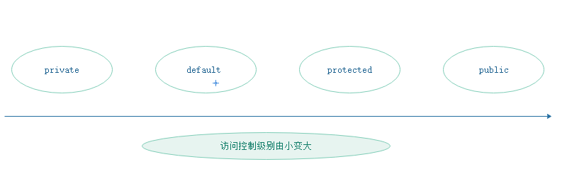

#### 要点：

* 创建并使用对象

* 对象和引用

* 封装

* 继承

* 多态

* 重载

#### 创建并使用对象

1.创建对象的根本途径是构造器，通过new关键字来调用某个类的构造器即可创建这个类的实例

```
class Nenmo{
    
    String name;

    int height;

}

Nenmo nenmo = new Nenmo();

```

#### 对象和引用

前面的代码

```

Nenmo nenmo = new Nenmo();
nenmo.name = "qianqian";

```

这行代码其实创建了两个东西 一个是变量nenmo 一个是对象Nenmo 而这个对象被赋值给了变量nenmo

从Nenmo类定义来看，Nenmo对象包含一个name实例变量，而这个变量是需要内存来存储的


  


Nenmo对象可以由多块内存组成，不同内存块分别存储对象不同成员变量，而当这个对象赋值给引用变量nenmo时，只需要将引用变量指向这个对象，也就是说引用变量实际存储的是一个引用，指向实际的对象


  
  

栈内存里的引用变量并未真正的存储对象的成员变量，对象的成员变量实际存放在堆内存，而引用变量只是指向堆内存的对象

当对象被创建成功后，这个对象会保存在堆内存，程序不允许直接访问堆内存中的对象，只能通过该对象的引用来操作该对象


问题1：构造器为什么不能用void修饰

答：实际上构造器是有返回值的，当我们new来调用构造器时构造器返回该类的实例 可以把这个类的实例当成返回值，但不能在构造器里显式返回当前类的对象，构造器的返回值是隐式的


#### 封装

Java提供了3个访问控制符，private protected public 分别代表3个访问控制级别，另外还有一个不加任何访问控制符的访问控制级别，提供了4个访问控制级别


  

  
  

  提示：如果一个Java源文件里定义的所有类都没有使用public修饰，则这个Java源文件的文件名可以是一切合法的文件名；但如果一个Java源文件里定义了一个public修饰的类则这个源文件的文件名必须与public修饰的类的类名相同

#### 继承

Java的继承通过extends关键字来实现，实现继承的类被称为子类，被继承的类称为父类，基类，父类和子类的关系就想Girl和Nenmo的关系，父类的范围总是比子类大

如果子类中想要调用父类中被覆盖的实例方法则可以使用super关键字来调用

super调用父类构造器必须出现在子类构造器执行体的第一行

#### 多态

Java引用变量有两个类型：编译时类型和运行时类型，编译时类型由声明该变量时使用的类型决定，运行时类型由实际赋给该变量的对象决定，而编译时类型和运行时类型不一致就会出现所谓的多态

```
class Girl {
    public void dance(){
        System.out.println("girl dance");
    }

    public void sing(){
        System.out.println("girl sing song");
    }
}

class Nenmo extends Girl{
    public void dance() {
        System.out.println("nenmo dance");
    }

    public void serve(){
        System.out.println("nenmo serve");
    }

    public static void main(String[] args) {
        Girl girl = new Nenmo();
        girl.sing(); //从父类继承到的方法
        girl.dance(); //当前类的方法
        //girl.serve(); //报错，girl编译时是Girl类型 没有serve方法
    }
}
```

当把一个子类对象Nenmo赋值给父类变量girl引用时，编译时是父类对象，运行时是子类对象，当运行时调用引用变量girl的方法时，总是表现出子类方法的行为特征，就出现了相同类型的变量调用同一个方法是呈现不同行为的特征，这就是多态

#### 重载

Java定义同一个类里可以定义多个同名的方法，但前提条件是形参列表不能相同，如果一个类中包含两个或两个以上同名方法，但形参列表不同则被称为方法重载

方法重载的要求： 同一类中方法名相同，参数列表不同，方法返回值 修饰符等与方法重载没有任何关系

```
    class Nenmo{
        public void serve(){
            System.out.println("Nenmo serve");
        }
        
        public void serve(String name){
            System.out.println(name + "serve");
        }
        
    }
```

问题2：为什么不用方法返回值区分重载的方法
答：如果方法为void 则无法区分