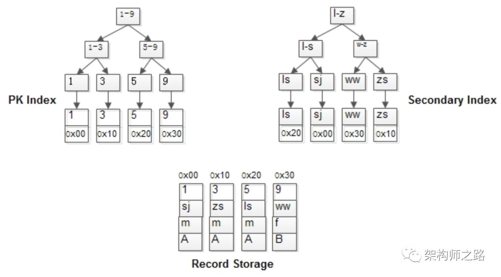
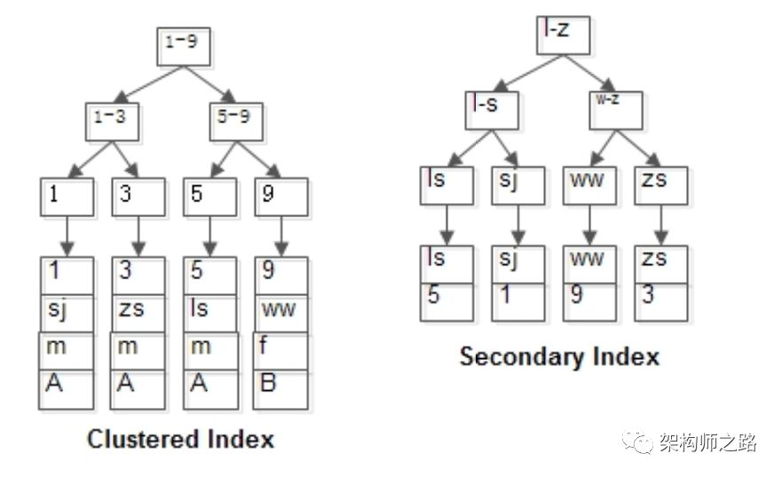
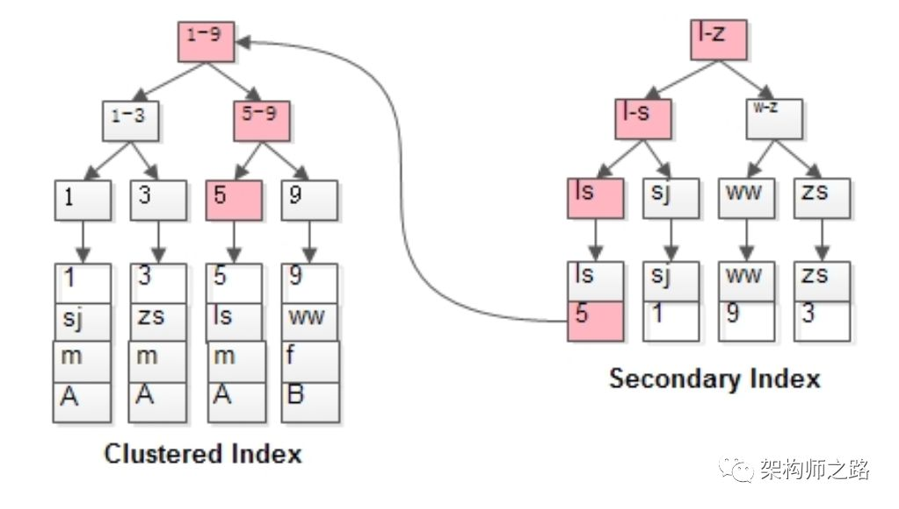

## MyISAM与InnoDB差异

（摘自58沈剑一分钟系列）

#### MyISAM的索引

MyISAM 的索引与行记录是分开存储的 叫做非聚集索引

主键索引与普通索引没有本质区别

* 有连续聚集的区域单独存储行记录

* 主键索引的叶子节点存储主键和与之对应的行记录的指针

* 普通索引的叶子节点存储索引列和与之对应的行记录的指针

* MyISAM的表可以没有主键

主键索引与普通索引是两棵独立的B+ 树 通过索引列查找时，先定位到B+树的子节点 在通过指针定位到行记录

举个例子，MyISAM：

t(id PK, name KEY, sex, flag);

表中有四条记录：

```

1, shenjian, m, A

3, zhangsan, m, A

5, lisi, m, A

9, wangwu, f, B

```

  

其B+树上的结构如上：

* 行记录单独存储

* id为PK ，有一棵id的索引树，叶子指向行记录

* name 为key，有一棵name的索引树 叶子也指向行记录

#### InnoDB的索引

InnoDB的主键索引与行记录是存储在一起的，故叫做聚集索引

特性:

* 没有单独区域存储行记录

* 主键索引的叶子节点，存储主键，与对应行记录（不是指针）所以主键索引的PK查询非常快

* 如果表定义了PK，则PK就是聚集索引

* 如果表没有定义PK，则第一个非空unique列是聚集索引

* 否则，InnoDB会创建一个隐藏的row-id作为聚集索引

* 聚集索引只能有一个，因为数据行在物理磁盘上只能有一份聚集存储

InnoDB的普通索引有多个 是跟聚集索引不同的

* 普通索引的叶子节点存储主键而不是指针

对于InnoDB表建议：

* 不建议使用较长的列当主键 如char(64) 因为所有的普通索引都会存储主键 会导致普通索引庞大

* 建议使用趋势递增的Key 做主键，由于数据行与索引一体 不至于插入数据时有大量索引分裂，行记录移动

例子，InnoDB

t(id PK, name KEY, sex, flag);

表中有四条记录：

```

1, shenjian, m, A

3, zhangsan, m, A

5, lisi, m, A

9, wangwu, f, B

```

  


其B+树索引构造如上图：

id为PK，行记录和id索引树存储在一起

name为KEY，有一棵name的索引树，叶子存储id

```
select * from t where name=‘lisi’;
```

  

会先通过name辅助索引定位到B+树的叶子节点得到id=5，再通过聚集索引定位到行记录，所以其实扫了两边索引树

#### 总结

MyISAM和InnoDB都使用B+树来实现索引

* MyISAM的索引与数据分开存储

* MyISAM的索引叶子存储指针，主键索引与普通索引没有本质上的区别

* InnoDB的聚集索引和数据行统一存储

* InnoDB的聚集索引存储数据行本身，普通索引存储主键

* InnoDB有且只有一个聚集索引

* InnoDB建议使用趋势递增整数作为PK
