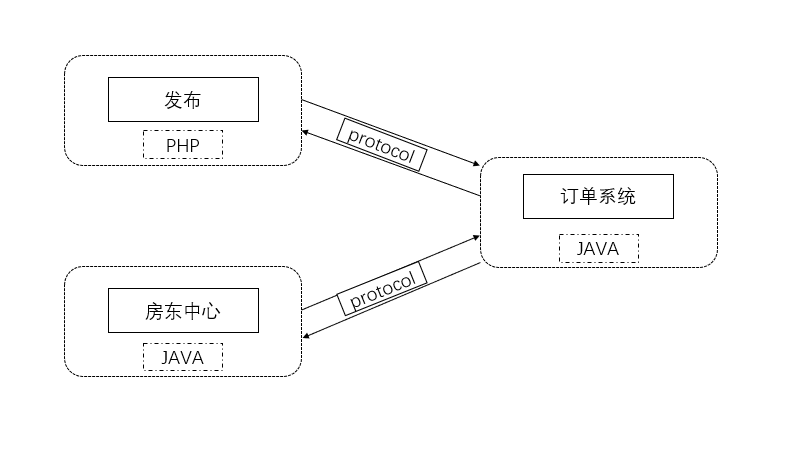
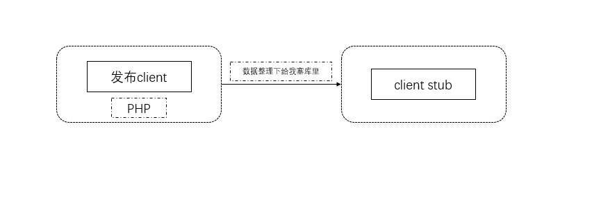
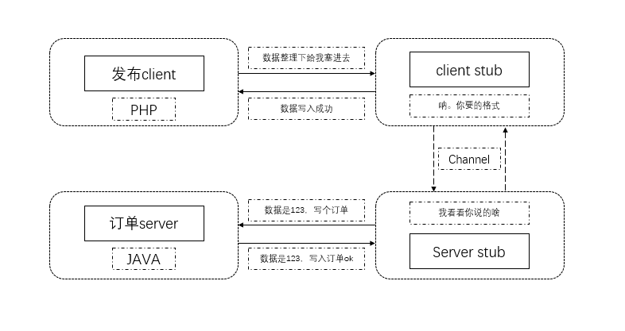

## RPC简介

#### 什么是RPC，有什么用？

RPC（Remote Procudure Call）远程过程调用，通俗讲就是一台机器上的程序可以调用另外一台机器上的程序，就像调用本地方法一样
 
#### 为什么用RPC，不是有HTTP了么？

1.一个字 就是快

RPC在OSI网络模型中跨越了传输层和应用层，相比于HTTP减少了header头部信息，并且不需要像http一样进行三次握手之类的，减少了网络开销

2.两个词  语言，协议

RPC不需要关心调用方和服务方使用什么语言，愿意是什么就是什么，可以是TCP，协议也可以是HTTP，只需要规定相同的协议，就可以相互调用，而协议是私密性的，传输更加安全


3.三句话 各干个的，互不影响，自我隔离

RPC不需要关心他人的逻辑，只需要封装自己的逻辑，各个模块隔离开，起到解耦服务，并且建立分布式计算更加容易


#### RPC的缺点有哪些？

1.性能的消耗：前面提到了RPC在进行通信时需要规定协议，而在对数据进行序列化及反蓄序列化的过程中很消耗性能，并且会很耗时

2.排查问题困难：RPC在使用的过程中需要对数据进行正反序列化，如果采用二进制的形式进行传输很难定位问题

3.上手有困难：对于RPC使用新手来说，这并不是一个像调用HTTP接口一样简单，并且需要程序去对server集群中的机器加权，降权，当然现在许多开源主流的RPC框架已经解决这个问题

4.在RPC的优势面前，以上三个缺点，都不是缺点

#### 目前主流的RPC框架

搜索了几个目前主流的RPC框架：

阿里的dubbo，HSF，dubbo为国内较早开源的服务治理的Java rpc框架

微博内部使用的motan，底层支持java

腾讯的Tars

百度的brpc

google的gRPC跨语言rpc框架

facebook的Thrift跨语言rpc框架

当然，没有58的SCF


#### RPC结构图什么样？

   

#### RPC工作原理是怎样的？

RPC的由Client，Client stub，Channel，Server stub，Server组成

1.Client为客户端调用方


2.Client stub为接口、方法和参数进行序列化成指定格式

   

3.Channel为客户端与服务端的sockets通信渠道


4.Server stub为接收到Client的方法和参数进行反序列化，并调用本地服务


5.Server为本地服务方

   

#### rpc调用代码片段

下面将展示rpc调用的伪代码片段


* client(调用方为PHP)

```
public function invoke($serviceName,$methodName,$params,$address)
{
    //将数据进行序列化，需要知道参数，调用方名称，调用方法
    $requestProtocol = ProtocolHelper::createProtocol($serviceName, $methodName,params);
    //通过ip+port方式请求获取数据
    $responseBinarydata = MethodCaller::request($requestProtocol, $serviceName, $address);
    //解析数据返回
    return ProtocolHelper::deCodeProtocolData($responseBinarydata);
}
```

* server(服务方为JAVA)

```
public void run() {
    //接收到客户端连接及请求，处理该请求
    objectInputStream = new ObjectInputStream(socket.getInputStream()); //把字节流转换为对象流
    //根据客户端请求，到map中找到对应的具体接口
    Class serviceClass = serverRegister.get(serviceName);
    //在具体接口找到对应的方法
    Method method = serviceClass.getMethod(methodName,parameterTypes);
    //执行该方法
    Object result = method.invoke(serviceClass.newInstance(),arguments);
    //将执行结果序列化返回给客户端
    objectOutputStream = new ObjectOutputStream(socket.getOutputStream());
    objectOutputStream.writeObject(result);
}

```

#### 什么时候用RPC?

搭建大型项目建议使用RPC，项目会越来越大，需要拆分成各个模块，比如58的租房业务，需要拆分为数据展示模块，数据写入模块，房源订单模块，支付模块等，通过模块化可以减小系统之间的耦合，并且可以独立部署，降低上线风险

小型系统就没有必要使用RPC了，比如要做一个房源评价后台，流量低，流程简单建议不用使用RPC


