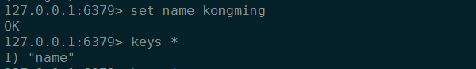
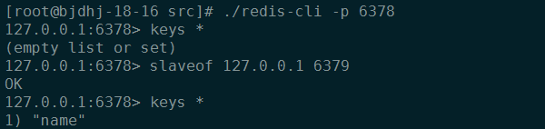
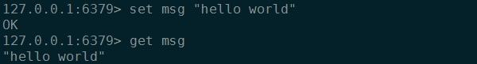
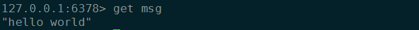
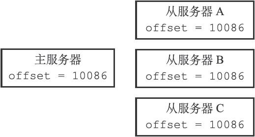
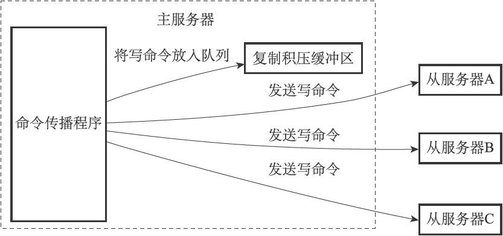
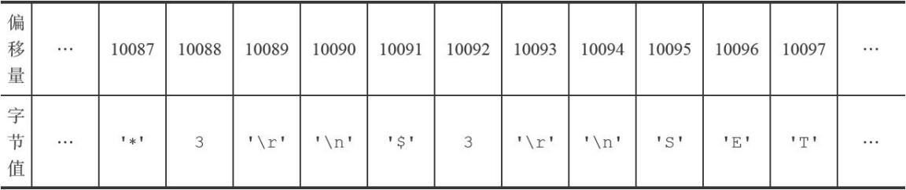
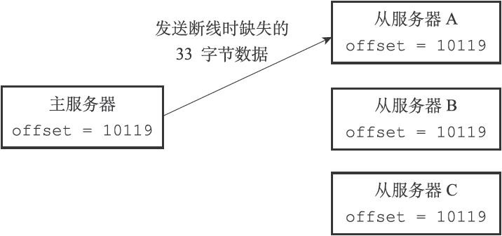

# 主从同步

  

  在Redis中，用户可以通过执行SLAVEOF命令或者设置slaveof选项让一个服务器去复制（replicate）另一个服务器，我们称呼被复制的服务器为主服务器（master）,而对主服务器进行复制的服务器为则称为从服务器（slave）
  
  假设现在有两个Redis服务器，地址分别为127.0.0.1:6379和127.0.0.1:6378,如果我们向服务器127.0.0.1:6378发送以下命令:
  那么服务器127.0.0.1:6378将成为127.0.0.1:6379的从服务器

  * 主从数据库将保存相同的数据，概念上称这种现象为"数据库状态一致"

      
    
      

  * 比如说我们在主服务器上执行以下命令

    

    那么我们应该可以在主服务器上获取msg键的值又可以在从服务器上获取msg键的值，删除同样 

    

  * 复制偏移量

    执行复制的双方--主服务器和从服务器会分别维护一个复制偏移量,主服务器每次向从服务器传播N个字节的数据时，就将自己的复制偏移量的值加上N,从服务器每次收到主服务器传播来的N个字节的数据就将自己的复制偏移量值加上N,通过对比主从服务器的复制偏移量，程序可以很容易的知道主从服务器是否处于一致状态
  
    

    考虑一种场景：假设当前主从服务器的复制偏移量都为10086，但是就在主服务器要向从服务器传播长度为33字节的数据之前，从服务器A断线那么主服务器传播的数据将只有从服务器B和C收到,在这之后,主服务器,从服务器B和C的复制偏移量都将更新为10119,A仍为10086,这时产生主从数据不一致

    

    * 假设A在断线后就立即重新连接主服务器并且成功,接下来向主服务器发送PSYNC命令报告当前的偏移量,那么这时主服务器应该对从服务器执行完整重同步还是部分同步?如果执行部分重同步主服务器又如何补偿从服务器A在断线期间丢失的那部分数据？下面将引出复制积压缓冲区

  * 复制积压缓冲区
  
    复制积压缓冲区是有主服务器维护的一个固定长度先进先出（FIFO）队列，默认大小为1MB

    固定长度先进先出队列
    对列长度固定,当入队元素的数量大于队列长度时，最先如归的元素会被弹出，而新元素放入队列
    举个列子：
    我们将'h','e','l','l','o'五个字符放进一个长度为3的固定长度先进先出队列那么结果将为['l','l','o']当主服务器进行命令传播时,它不仅会将写命令发送给所有的从服务器,还会将命令入队到复制积压缓冲区

    

    因此主服务器的复制积压缓冲区会保存一部分最近传播的写命令,并且复制积压缓冲区会为队列中的每个字节记录相应的复制偏移量

    

    当从服务器重新连接上主服务器时,从服务器通过PSYNC命令将自己的复制偏移量offset发动给主服务器,如果offset偏移量之后的数据仍存在复制积压缓冲区里面那么主服务器将对从服务器执行部分重同步操作,相反如果offset偏移量之后的数据已经不存在于复制积压缓冲区那么主服务器将对从服务器执行完整重同步操作

    

    复制积压缓冲器公式：从服务器断线后重新连接主服务器所需的平均时间*主服务器平均每秒产生的写命令数据量

  * 服务器运行ID
    每个Redis服务器都会有自己的运行ID 在启动时自动生成 由40个随机的十六进制字符组成,当从服务器对主服务器进行初次复制时,主服务器会将自己的运行ID传送给从服务器,当从服务器断线重连上一个主服务器时会向当前连接的主服务器发送之前的主服务运行ID,如果ID相同说明重连的是之前的主服务器,如果不同将会执行完成重同步操作

  * PSYNC
    如果从服务器以前没有复制过任何服务器那么开始一次新的复制时将向主服务器发送PSYNC ? -1 命令 主动请求主服务器进行完整重同步
    相反将发送PSYNC <runid> <offset>
    接受到PSYNC命令的主服务器会向从服务器返回以下三种回复的一种
  	1) FULLRESYNC <runid> <offset> 表示主服务器将于从服务器执行完成重同步操作
  	2) CONTINUE 表示主服务器将与从服务器执行部分重同步操作
  	3) -ERR 表示主服务器版本低于Redis 2.8 不能识别PSYNC
  