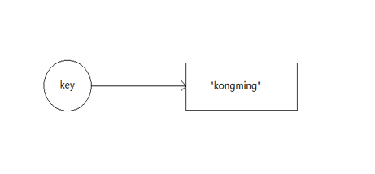
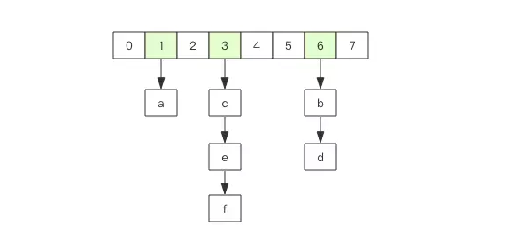
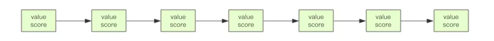
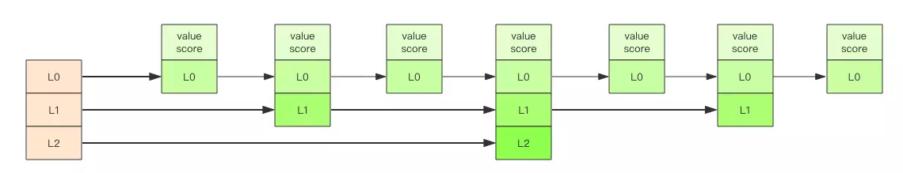

## Redis基础数据结构

* Redis基础数据结构分为5大类型,下面将分别对这5大类型进行简单的讲解
* Redis所有的数据结构都是以唯一的key作为名称,通过这个唯一的key获取对应的value值,value结构的不同造成是数据结构差异的根本原因

#### string(字符串)

  


* 字符串string--Redis最简单的数据结构
* 字符串最常用的就是缓存用户信息,我们可以将用户的信息JSON序列化为字符串塞进Redis来缓存
* Redis的字符串是动态字符串,内部实现相采用预分配冗余空间来减少内存的频繁分配
* 扩容方式为加倍现有的空间,超过1M,扩容时只会多扩展1M 最大长度为512M

##### 键值对

```
127.0.0.1:6379> set name kongming
OK
127.0.0.1:6379> get name
"kongming"
127.0.0.1:6379> exists name
(integer) 1
127.0.0.1:6379> del name
(integer) 1
127.0.0.1:6379> get name
(nil)
```

##### 批量键值对 批量读写 节省网络耗时开销

```
127.0.0.1:6379> set name1 kongming01
OK
127.0.0.1:6379> set name2 kongming02
OK
127.0.0.1:6379> mget name1 name2
1) "kongming01"
2) "kongming02"
127.0.0.1:6379> mset name1 zhangsan name2 lisi
OK
127.0.0.1:6379> mget name1 name2
1) "zhangsan"
2) "lisi"
```

##### 过期和 set 命令扩展 对key设置过期时间 控制缓存失效时间
```
127.0.0.1:6379> set name kongming
OK
127.0.0.1:6379> get name
"kongming"
127.0.0.1:6379> expire name 5
(integer) 1
127.0.0.1:6379> get name
"kongming"
127.0.0.1:6379> get name
(nil)
127.0.0.1:6379> setex name 5 kongming
OK
127.0.0.1:6379> get name
"kongming"
127.0.0.1:6379> get name
(nil)
127.0.0.1:6379> setnx name kongming
(integer) 1
127.0.0.1:6379> get name
"kongming"
127.0.0.1:6379> setnx name kongming01
(integer) 0
127.0.0.1:6379> get name
"kongming"
```

##### 计数  对于value为整数 可以让其进行自增操作

```
127.0.0.1:6379> set age 18
OK
127.0.0.1:6379> incr age
(integer) 19
127.0.0.1:6379> incrby age 5
(integer) 24
127.0.0.1:6379> incrby age -5
(integer) 19
127.0.0.1:6379> set age 9223372036854775807
OK
127.0.0.1:6379> incr age
(error) ERR increment or decrement would overflow
```

---

#### list(列表)

  

* Redis的列表是链表而非数组,这意味着list的插入和删除操作非常快,时间复杂度为O(1),但是索引定位很慢,时间复杂度为O(n)
* 当列表弹出最有一个元素时,数据结构被删除,内存被回收
* Redis 的列表结构通常用来做异步队列来使用,将任务结构体序列化为字符串塞进List,另起任务来轮询消费数据

##### 右边进左边出:队列

```
127.0.0.1:6379> rpush name kongming01 kongming02 kongming03
(integer) 3
127.0.0.1:6379> llen name
(integer) 3
127.0.0.1:6379> lpop name
"kongming01"
127.0.0.1:6379> lpop name
"kongming02"
127.0.0.1:6379> lpop name
"kongming03"
127.0.0.1:6379> lpop name
(nil)
```

##### 右边进右边出:栈

```
127.0.0.1:6379> rpush name kongming01 kongming02 kongming03
(integer) 3
127.0.0.1:6379> rpop name
"kongming03"
127.0.0.1:6379> rpop name
"kongming02"
127.0.0.1:6379> rpop name
"kongming01"
127.0.0.1:6379> rpop name
(nil)

```

##### 慢操作

* index 相当于链表的get(int index) 方法,需要对链表进行遍历,性能随着index增大而变差
* ltrim可以根据start_index,end_index 定义区间,区间之外数据全部砍掉,变为定长链表

```
127.0.0.1:6379> rpush name kongming01 kongming02 kongming03
(integer) 3
127.0.0.1:6379> lindex name 1
"kongming02"
127.0.0.1:6379> lrange name 0 -1
1) "kongming01"
2) "kongming02"
3) "kongming03"
127.0.0.1:6379> ltrim name 1 -1
OK
127.0.0.1:6379> lrange name 0 -1
1) "kongming02"
2) "kongming03"
127.0.0.1:6379> ltrim name 1 0
OK
127.0.0.1:6379> llen name
(integer) 0
```  

##### 快速列表

  


* Redis 列表底层并不是一个简单的linkedlist 而是quicklist
* 在列表元素较少的情况下会使用一块连续的内存存储,结构为ziplist(压缩列表)
* 当数据量较多的情况下改成quicklist,也就是将多个ziplist使用双向指针串起来,这样既满足了快速的插入删除性能,又不会出现太大的空间冗余


---
#### hash(字典)

  


* Redis 的hash 相当于java里面的hashMap ,是无序字典,同样的数组+链表的二维结构
* 不同的是字典的值只能是字符串, 另外rehash的方式不一样
* 缺点 hash结构存储消耗高于单个字符串
* 同字符串一样,hash结构中单个key也可以进行计数,指令为hincrby,和incr使用一样

```
127.0.0.1:6379> hset name kongming01 "this is kongming01"
(integer) 1
127.0.0.1:6379> hset name kongming02 "this is kongming02"
(integer) 1
127.0.0.1:6379> hset name kongming03 "this is kongming03"
(integer) 1
127.0.0.1:6379> hgetall name
1) "kongming01"
2) "this is kongming01"
3) "kongming02"
4) "this is kongming02"
5) "kongming03"
6) "this is kongming03"
127.0.0.1:6379> hlen name
(integer) 3
127.0.0.1:6379> hget name kongming01
"this is kongming01"
127.0.0.1:6379> hmset name kongming01 "this is kongming01 test" kongming02 "this is kongming02 test"
OK
```

```
127.0.0.1:6379> hset kongming age 18
(integer) 1
127.0.0.1:6379> hincrby kongming age 1
(integer) 19
```

---
#### set(集合)

  


* Redis里的集合相当于hashSet ,内部的键值对是无须但唯一的,内部相当于一个特殊的字典,所有的value值为null
* 当集合中最后一个元素被删除时,结构被回收 内存被回收
* set结构可以用来存储中奖用户id,因为有去重功能

```
127.0.0.1:6379> sadd name kongming01
(integer) 1
127.0.0.1:6379> sadd name kongming01
(integer) 0
127.0.0.1:6379> sadd name kongming02 kongming03
(integer) 2
127.0.0.1:6379> smembers name
1) "kongming02"
2) "kongming01"
3) "kongming03"
127.0.0.1:6379> sismember name kongming01
(integer) 1
127.0.0.1:6379> sismember name kongming04
(integer) 0
127.0.0.1:6379> scard name
(integer) 3
127.0.0.1:6379> spop name 
"kongming02"
127.0.0.1:6379> smembers name
1) "kongming01"
2) "kongming03"
```


#### zset(有序列表)

* Redis 有序列表一方面是一个set 保证value的唯一性,另一方面可以给每个value赋一个分数 代表排序权重
* 数据结构为跳跃表
* zset 可以用来存储粉丝列表,value值为用户id,关注事件为分数,可以按关注时间排序
* zset 最后一个value被移除后,数据结构自动删除,内存回收

```
127.0.0.1:6379> zadd kongming 9.0 "kongming01"
(integer) 1
127.0.0.1:6379> zadd kongming 8.9 "kongming02"
(integer) 1
127.0.0.1:6379> zadd kongming 8.6 "kongming03"
(integer) 1
127.0.0.1:6379> zrange kongming 0 -1
1) "kongming03"
2) "kongming02"
3) "kongming01"
127.0.0.1:6379> zrevrange kongming 0 -1
1) "kongming01"
2) "kongming02"
3) "kongming03"
127.0.0.1:6379> zcard kongming
(integer) 3
127.0.0.1:6379> zscore kongming "kongming02"
"8.9000000000000004"
127.0.0.1:6379> zrank kongming "kongming01" //排名
(integer) 2
127.0.0.1:6379> zrank kongming "kongming03"
(integer) 0
```

##### 跳跃表
因为zset需要支持随机的插入和删除,所以不好使用数组来表示
普通的链表结构

  
  
  
我们需要这个链表按照分数进行排序,这意味当有新元素插入时,要定位到特定位置的插入点,才能保证链表有序
通常的做法是使用二分查找找到插入点,但二分查找的对象是数组,链表做不到

跳跃表类似于一种层级制,最下面的所有元素都会串起来,每隔几个元素就会选出一个代表,在将代表用指针串起来
最终形成金字塔形状
  
  
跳跃表之所以跳跃是因为内部的元素可能身兼数职 比如上图中间的元素同时处于L0,L1 和L2层 可以快速在不同层次之间跳跃
定位插入点,先在顶层进行定位,然后下潜到下一级定位,一直下潜到最底层找到最合适的位置将新元素插入

跳跃列表采取一个随机策略来决定新元素可以兼职到第几层


#### 容器型数据结构的通用规则

list/set/hash/zset 这四种数据结构是容器型数据结构,它们共享下面两条通用规则:

1.create if not exists

2.drop if no elements


#### 过期时间

* 过期时间是以对象为单位 而不是其中的子 key
* 字符串设置了过期时间在调用set方法修改 过期时间会失效
```
127.0.0.1:6379> set name kongming
OK
127.0.0.1:6379> expire name 500
(integer) 1
127.0.0.1:6379> ttl name
(integer) 497
127.0.0.1:6379> set name kongming
OK
127.0.0.1:6379> ttl name
(integer) -1
```

