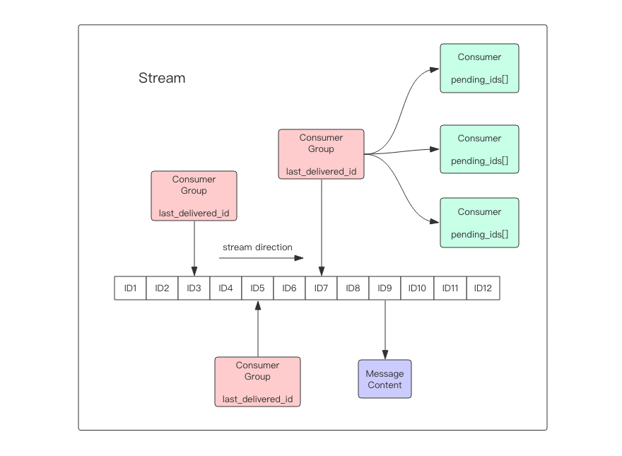

## Stream-Redis 5.0新数据结构

Redis最大的特性就是多出来一个数据结构Stream 一个支持多播的可持久化消息队列

* Stream结构由一条消息链表组成将所有的消息都串起来

* 每一个消息都有一个唯一的ID和对应的内容

* 消息是持久化的redis重启消息还在 具体存储结构为rdb+aof

* 每个Stream都有唯一的名称,也就redis的键，首次使用xadd指令时自动创建

* 每个Stream可以挂多个消费组,每个消费组会有游标last_delivered_id 在Stream数组之上往前移动，表示当前消费组已经消费到哪条消息

* 消费组不会自动创建需要指定从Stream的某个消息ID开始消费，这个ID用来初始化last_delivered_id变量

* 每个消费组都有一个Stream内唯一的名称

* 每个消费组（Consumer Group）的状态都是独立的，相互不受影响 也就是说同一份Stream内部的消息会被每个消费组消费到

* 同一个消费组可以挂多个消费者这些消费者之间是竞争关系，任意一个消费者读到了消息都会是游标last_delivered_id往前移动 每个消费者都有一个组内唯一名称

* 消费者（Cunsumer）内部会有一个状态变量pending_ids激励当前已经被客户端读取的消息，但是没有ack 如果客户端没有ack这个变量里面的消息ID会越来越多，一旦某个消息被ack它就开始减少，这个pending_ids变量在redis官方被称为PEL 也就是Pending Entries List hi一个核心的数据结构，用来确保客户端至少消费了消息一次，而不会在网络传输的中途丢失了没处理

#### 消息ID

* 消息ID形式为timestampInMillis-sequence

* 消息ID可以有服务器自动生成也可以有客户端自己指定

* 形式必须为整数-整数 后面加入的消息ID要大于前面的消息ID

#### 增删改查

1.xadd 追加消息

~~~
# * 号表示服务器自动生成 ID，后面顺序跟着一堆 key/value

127.0.0.1:6379> xadd info * name kongming age 18
"1542443491682-0"
127.0.0.1:6379> xadd info * name kongming1 age 19
"1542443504631-0"
127.0.0.1:6379> xadd info * name kongming2 age 20
"1542443513609-0"
~~~

2.xrange 获取消息列表，会自动过滤已经删除的消息

~~~
# -表示最小值 , + 表示最大值

127.0.0.1:6379> xrange info - +
1) 1) "1542443491682-0"
   2) 1) "name"
      2) "kongming"
      3) "age"
      4) "18"
2) 1) "1542443504631-0"
   2) 1) "name"
      2) "kongming1"
      3) "age"
      4) "19"
3) 1) "1542443513609-0"
   2) 1) "name"
      2) "kongming2"
      3) "age"
      4) "20"
127.0.0.1:6379> xrange info 1542443504631-0 +
1) 1) "1542443504631-0"
   2) 1) "name"
      2) "kongming1"
      3) "age"
      4) "19"
2) 1) "1542443513609-0"
   2) 1) "name"
      2) "kongming2"
      3) "age"
      4) "20"
127.0.0.1:6379> xrange info - 1542443504631-0
1) 1) "1542443491682-0"
   2) 1) "name"
      2) "kongming"
      3) "age"
      4) "18"
2) 1) "1542443504631-0"
   2) 1) "name"
      2) "kongming1"
      3) "age"
      4) "19"
~~~

3.xlen 消息长度

~~~
127.0.0.1:6379> xlen info
(integer) 3
~~~

4.xdel 删除消息

~~~
127.0.0.1:6379> xdel info 1542443491682-0
(integer) 1
127.0.0.1:6379> xrange info - +
1) 1) "1542443504631-0"
   2) 1) "name"
      2) "kongming1"
      3) "age"
      4) "19"
2) 1) "1542443513609-0"
   2) 1) "name"
      2) "kongming2"
      3) "age"
      4) "20"
~~~

5.del 删除 Stream

~~~
#删除整个Stream
127.0.0.1:6379> del info
(integer) 1
~~~

#### 独立消费

* 我们可以在不定义消费组的情况下进行Stream的独立消费

* Stream没有新消息时可以阻塞等待

* xread命令可以将Stream当成普通的消息队列来使用

* 当使用xrand时可以完全忽略消费组的存在

~~~
# 从 Stream 头部读取两条消息
127.0.0.1:6379> xread count 2 streams info 0-0
1) 1) "info"
   2) 1) 1) "1542445226454-0"
         2) 1) "name"
            2) "kongming01"
            3) "age"
            4) "18"
      2) 1) "1542445232596-0"
         2) 1) "name"
            2) "kongming02"
            3) "age"
            4) "19"
# 从Stream 尾部读取一条消息,这里不会返回任何消息
127.0.0.1:6379> xread count 2 streams info $
(nil)
127.0.0.1:6379> xread count 2 streams info 1542445232596-0
1) 1) "info"
   2) 1) 1) "1542445238791-0"
         2) 1) "name"
            2) "kongming03"
            3) "age"
            4) "20"
# 从尾部阻塞等待新消息到来，下面的指令会堵住，直到新消息到来

127.0.0.1:6379> xread block 0 count 1 streams info $

# 我们从新打开一个窗口，在这个窗口往 Stream 里塞消息

127.0.0.1:6379> xadd info * name kongming04 age 21
"1542445624498-0"

# 再切换到前面的窗口，我们可以看到阻塞解除了，返回了新的消息内容
# 而且还显示了一个等待时间，这里我们等待了 3.02s
1) 1) "info"
   2) 1) 1) "1542445624498-0"
         2) 1) "name"
            2) "kongming04"
            3) "age"
            4) "21"
(3.02s)

# block 0 表示永远阻塞,直到消息到来,block 1000 表示阻塞 1s,如果1s内没有任何消息到来,就返回 nil
127.0.0.1:6379> xread block 1000 count 1 streams info $ 
(nil)
(1.06s)
~~~

* 客户端如果想使用xread进行顺序消费一定要记住当前消费返回的消息ID,下次调用xread的时候把ID传进去可以消费后面的数据

#### 消费组

