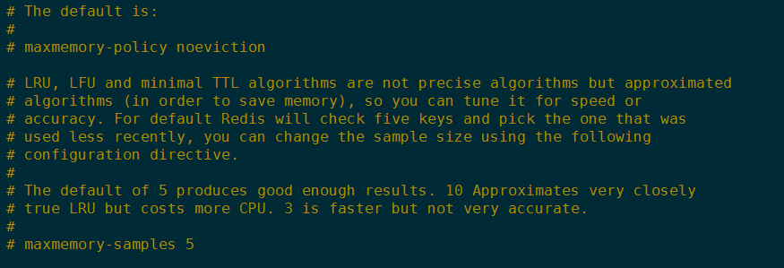

## Redis 过期策略

redis会将每个设置了过期时间的key放入到一个独立的字典中,以后会定时遍历这个字典来删除到期的key。除了定时遍历之外,它还会使用惰性策略来删除过期的key

对于一个过期的键有一下三种不同的删除策略

1.定时删除：在设置键的过期时间的同时创建一个定时器,让定时器在键的过期时间来临时立即执行对键的删除操作

2.惰性删除：放任键过期不管,在客户端访问这个key的时候,redis对key的过期时间进行检查,如果过期了就立即删除

3.定期删除： 每隔一段时间程序就对数据库进行一次检查,删除里面的过期键

##### 定时删除

* 优点：对内存最友好的,通过使用定时器定时产式策略可以保证过期键会尽可能快的被删除并释放过期键所占用的内存

* 缺点：对CPU时间是不友好的,在过期键比较多的情况下删除过期键这一行为可能会占用相当一部分CPU时间,在内存不紧张但是CPU紧张的情况下将CPU时间用在删除和当前任务无关的过期键上会影响服务器的响应时间和吞吐量

##### 惰性删除

* 优点：对CPU时间来说是友好的,程序只会在取出键时才对键进行过期检查保证删除过期键时已经到了非做不可的地步,并且删除的目标仅限于当前处理的键不会在删除其他过期键花费CPU时间

* 缺点：对内存不友好的,过期的键仍然保留在内存中,占用内存不会被释放,无用的垃圾数据占用了大量的内存而服务器却不去释放他们 对于依赖于内存来说的redis肯定是不友好的

##### 定期删除

* 定期删除策略每隔一段时间执行一次删除过期键操作并通过限制删除操作执行的时长和频率来减少对CPU时间的影响

* 定期删除减少过期键带来的内存浪费

* 如果删除操作过于频繁或者执行时间太长定期删除就退化为定时删除以至于将CPU时间过多的消耗在删除过期键上面

* 如果删除操作执行的太少或者执行时间太短定期删除就会和懒惰删除一样,出现浪费内存的情况

* 默认每秒进行10次过期扫描,过期扫描不会遍历过期字典中所有的key,而是采用了一种简单的贪心策略

	1.从过期字典中随机 20 个 key；
	
	2.删除这 20 个 key 中已经过期的 key；
	
	3.如果过期的 key 比率超过 1/4，那就重复步骤 1；

* 为了保证过期扫描不会出现循环过度，导致线程卡死现象，算法还增加了扫描时间的上限，默认不会超过 25ms

## 淘汰算法

当Redis内存超出物理内存限制时Redis提供了几种可选策略 (maxmemory-policy) 来让用户自己决定该如何腾出新的空间以继续提供读写服务

* noeviction 不会继续服务写请求 (DEL 请求可以继续服务)，读请求可以继续进行。这样可以保证不会丢失数据，但是会让线上的业务不能持续进行。这是默认的淘汰策略

* volatile-lru 尝试淘汰设置了过期时间的 key，最少使用的 key 优先被淘汰。没有设置过期时间的 key 不会被淘汰，这样可以保证需要持久化的数据不会突然丢失

* volatile-ttl 跟上面一样，除了淘汰的策略不是 LRU，而是 key 的剩余寿命 ttl 的值，ttl 越小越优先被淘汰

* volatile-random 跟上面一样，不过淘汰的 key 是过期key集合中随机的key

* allkeys-lru 区别于 volatile-lru，这个策略要淘汰的key对象是全体的 key 集合，而不只是过期的 key 集合。这意味着没有设置过期时间的 key 也会被淘汰

* allkeys-random 跟上面一样，不过淘汰的策略是随机的key

volatile-xxx 策略只会针对带过期时间的 key 进行淘汰，allkeys-xxx 策略会对所有的 key 进行淘汰。
如果你只是拿 Redis 做缓存，那应该使用 allkeys-xxx，客户端写缓存时不必携带过期时间。如果你还想同时使用 Redis 的持久化功能，那就使用 volatile-xxx 策略，这样可以保留没有设置过期时间的 key，它们是永久的 key 不会被 LRU 算法淘汰

##### LRU及近似LRU算法

* 实现LRU算法除了需要 key/value 字典外还需要附加一个链表,链表中的元素按照一定的顺序进行排列,当空间满的时候会踢掉链表尾部的元素,当字典的某个元素被访问时,它在链表中的位置会被移动到表头,所以链表的元素排列顺序就是元素最近被访问的时间顺序

* Redis实际使用的是一种近似LRU算法,因为LRU算法需要消耗大量的内存以及对数据结构大幅度的改动,近似的LRU算法是在现有数据结构的基础上随机采样来淘汰元素,它为每个key增加了一个额外的长度24个bit的小字段来记录最后一次被访问的时间戳

* 当Redis进行写操作时发现内存超出maxmemory就会执行LUR淘汰算法,算法是随意采样5（default）个key淘汰掉最旧的key,直到内存低于maxmemory 采样大小为redis.conf中的 maxmemory-samples,如何采样就是看 maxmemory-policy 的配置,如果是 allkeys 就是从所有的 key 字典中随机,如果是 volatile 就从带过期时间的key字典中随机

## 懒惰删除

* 删除指令 del 会直接释放对象的内存,如果对一个特别大的key进行del那么操作就有可能导致单线程卡顿,为了解决这个问题redis引入了unlink指令对删除操作进行懒处理,异步回收内存

~~~
127.0.0.1:6379> set name kongming
OK
127.0.0.1:6379> unlink name
(integer) 1
~~~

* flush

Redis提供了flushdb和flushall指令来清空数据,这也是极其缓慢的操作,Redis同样给这两个指令也带来了异步化,在指令后面增加 async 参数就可以扔给后台线程慢慢处理

~~~
127.0.0.1:6379> flushall async
OK
~~~
