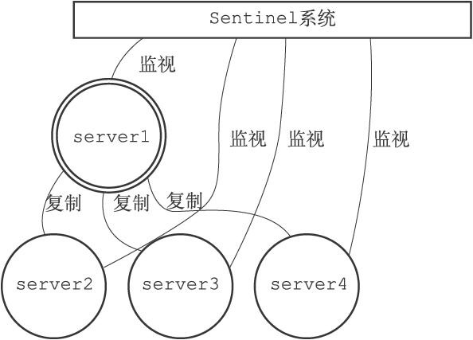
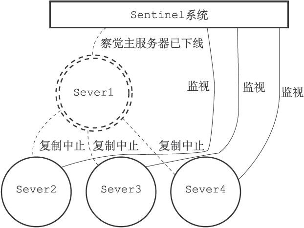
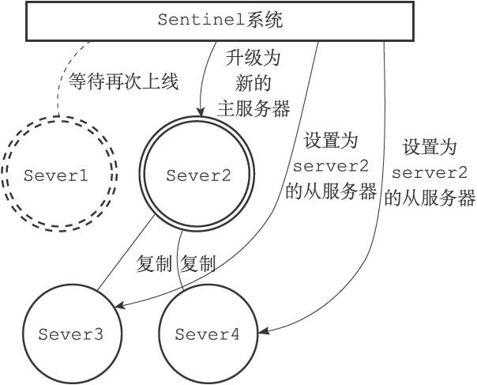
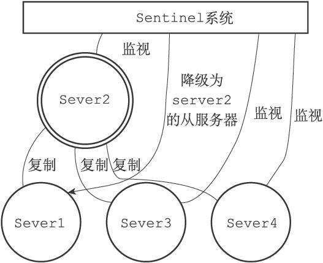

## Redis集群-Sentinel

#### Sentinel是Redis的高可用解决方案，由一个或多个Sentinel实例组成的Sentinel系统可以监视任意多个主服务区，以及这些主服务器属下的所有从服务器并在被监视的主服务器进入下线状态时，自动将下线主服务器属下的某个从服务器升级为新的主服务器然后由新的主服务器代替已下线的主服务区继续处理命令请求

	

* 主服务器server1进入下线状态,从服务器server2,server3,server4对server1的复制操作将中止，Sentinel察觉到server1下线

	

* server1下线时间超过用户设定的上限时,Sentinel挑选server1属下的其中一个从服务器升级为主服务器,Sentinel系统向server1属下所有从服务器发送新的复制指令,让他们成为新主服务器的从服务器

	

* Sentinel系统继续监听已下线的server1,上线后成为从服务器

	

